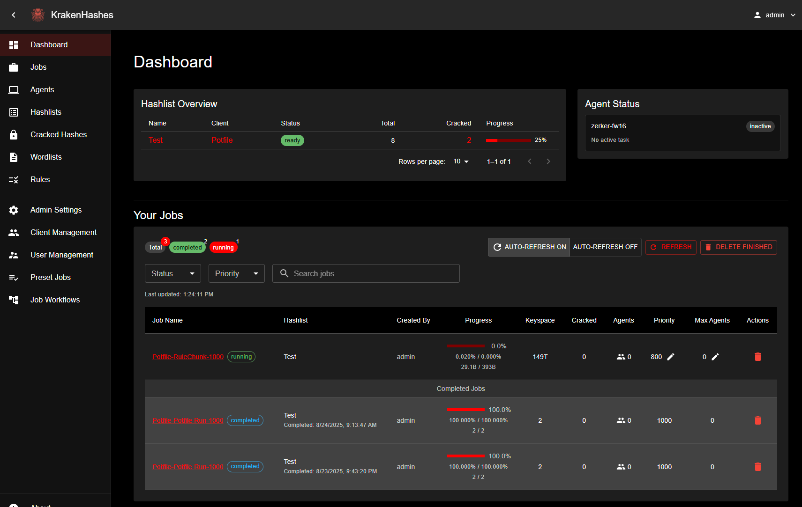

# KrakenHashes

KrakenHashes is a distributed password cracking system designed for security professionals and red teams. The platform coordinates GPU/CPU resources across multiple agents to perform high-speed hash cracking using tools like Hashcat through a secure web interface. Think of KrakenHashes as a full management system for hashes during, after and before (if a repeat client). Ideally, while also checking hashes for known cracks, we update a potfile with every hash and that can be used as a first run against other types of hashes for a potential quick win.

## Disclaimer

**⚠️ Active Development Warning**  
This project is currently in released and used in production environments. Key considerations:

> **Use at your own risk** - This software may eat your data, catch fire, or summon a digital Kraken. You've been warned.

With the release of version 2.0.0, it should be a working for it's intended uses. While it may have bugs, I request that you open an issue (bottom of the frontend has a link). This tool is for legitimate professionals with permission from clients to run hashes for their testing. I am not responsible for how you use the tool or anything you do with it. In addition while the docs should be helpful, please let me know if you identify any issues.

## Component Details

### Backend Service (Go)

-   Job scheduler with adaptive load balancing
-   REST API endpoints with JWT authentication
-   PostgreSQL interface for job storage/results

### Agent System (Go)

-   Hardware resource manager (GPU/CPU allocation)
-   Hashcat wrapper with automatic checkpointing
-   Distributed work unit management
-   Healthcheck system with self-healing capabilities

### Web Interface (React)

-   Real-time job progress visualization
-   Hash type detection and configuration wizard
-   MFA configuration and recovery flow
-   Interactive reporting and analytics

## Use Cases

-   Penetration testing teams coordinating attacks
-   Forensic investigators recovering protected evidence
-   Red teams executing credential stuffing attacks
-   Research analyzing hash vulnerabilities
-   Security training environments

> **License**: AGPLv3 (See LICENSE.md)  
> **Status**: Actively in development, there will be bugs but it is getting less every day. The project is stable and can be used for production environments.

## Documentation

Comprehensive documentation is available in the [docs/](docs/) directory:

-   **[Quick Start](https://zerkereod.github.io/krakenhashes/latest/getting-started/quick-start/)** - Quick start guide for installation
-   **[Documentation Index](https://zerkereod.github.io/krakenhashes/latest/)** - Complete documentation overview
-   **[User Guide](https://zerkereod.github.io/krakenhashes/latest/user-guide/)** - Understanding jobs and workflows
-   **[Admin Guide](https://zerkereod.github.io/krakenhashes/latest/admin-guide/)** - Creating and managing attack strategies
-   **[Docker Setup](https://zerkereod.github.io/krakenhashes/latest/deployment/docker/)** - Getting started with Docker

## Community

Join our Discord community for support, discussions, and updates:

-   **[Discord Server](https://discord.com/invite/taafA9cSFV)** - Connect with other KrakenHashes users

## Development

Instructions for setting up and running each component can be found in their respective directories.

### Version 3.0.0 Considerations

-   [ ] Better file syncing to agents
-   [ ] Use bloodhound data for client password analytics
