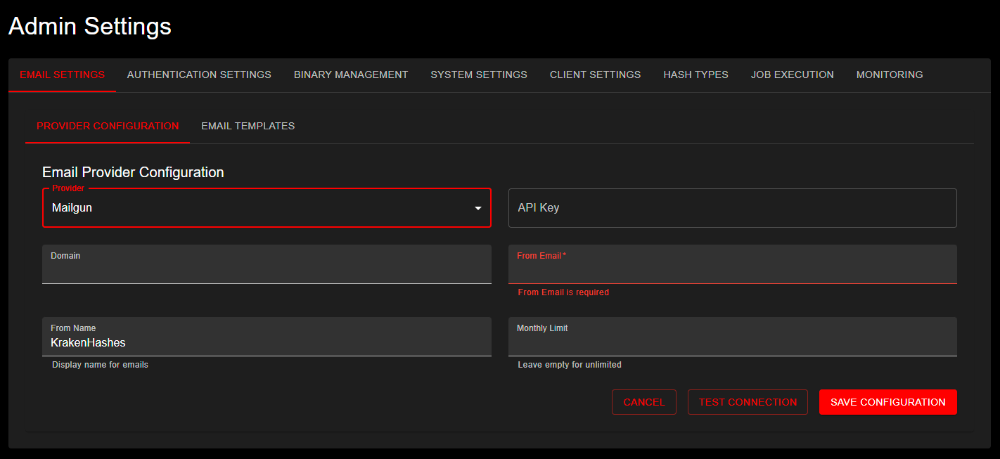

# Client Management

KrakenHashes allows associating hashlists with specific clients or engagements. This helps organize work and enables tailored settings, such as data retention policies, potfile controls, and dedicated client wordlists.

## Overview

-   **Purpose:** Clients represent distinct entities (e.g., internal teams, external customers, specific penetration testing engagements) for which hashlists are managed.
-   **Association:** Hashlists can be optionally linked to a client during upload.
-   **Administration:** Administrators can create, view, update, and delete client records.
-   **Client Potfile:** Each client can have an automatically generated potfile containing passwords cracked from their hashlists, usable as a targeted wordlist in future jobs.
-   **Client Wordlists:** Clients can have dedicated wordlists uploaded and managed separately from the global wordlist system.
-   **Potfile Controls:** Per-client settings control whether cracked passwords are written to the global potfile, the client potfile, and whether passwords are surgically removed when hashlists are deleted.


*Client Management page showing the data table with columns for Name, Description, Contact, Retention period, Creation date, and available Actions*

## Managing Clients via API

Administrators use the following API endpoints to manage clients:

-   **`GET /api/admin/clients`**
    -   **Description:** Lists all existing clients.
    -   **Response:** An array of client objects.

-   **`POST /api/admin/clients`**
    -   **Description:** Creates a new client.
    -   **Request Body (Example):**
        ```json
        {
          "name": "Project Hydra",
          "description": "Q3 Internal Assessment",
          "contact_info": "team-lead@example.com",
          "exclude_from_potfile": false,
          "exclude_from_client_potfile": false,
          "remove_from_global_potfile_on_hashlist_delete": null,
          "remove_from_client_potfile_on_hashlist_delete": null
        }
        ```
    -   `name` is required and must be unique.
    -   `description` and `contact_info` are optional.
    -   **Response:** The newly created client object.

-   **`GET /api/admin/clients/{id}`**
    -   **Description:** Retrieves details for a specific client by its UUID.
    -   **Response:** A single client object.

-   **`PUT /api/admin/clients/{id}`**
    -   **Description:** Updates an existing client.
    -   **Request Body:** Same format as POST, but fields are optional (only provided fields are updated).
    -   **Response:** The updated client object.

-   **`DELETE /api/admin/clients/{id}`**
    -   **Description:** Deletes a client.
    -   **Important:** Deleting a client typically also involves cleaning up associated resources like hashlists or reassigning them. The exact behavior might depend on implementation details (e.g., whether associated hashlists are deleted or disassociated).
    -   **Response:** Typically a 204 No Content on success.

### Client Fields

| Field | Type | Default | Description |
|-------|------|---------|-------------|
| `name` | string | (required) | Client name, must be unique |
| `description` | string | (optional) | Free-text description |
| `contact_info` | string | (optional) | Contact information |
| `exclude_from_potfile` | boolean | `false` | When `true`, cracked passwords for this client are NOT added to the global potfile |
| `exclude_from_client_potfile` | boolean | `false` | When `true`, cracked passwords for this client are NOT added to the client-specific potfile |
| `remove_from_global_potfile_on_hashlist_delete` | boolean or null | `null` | Controls automatic removal from global potfile on hashlist delete. `null` = use system default, `true` = always remove, `false` = never remove |
| `remove_from_client_potfile_on_hashlist_delete` | boolean or null | `null` | Controls automatic removal from client potfile on hashlist delete. `null` = use system default, `true` = always remove, `false` = never remove |

> **Note on exclusion semantics:** The `exclude_from_*` fields use "exclude" semantics. The default value of `false` means "include" (passwords ARE written to the potfile). Setting to `true` means "exclude" (passwords are NOT written).

> **Note on null removal settings:** When set to `null`, the system default from `system_settings` is used. When set to a boolean, it overrides the system default and the user cannot change it at hashlist delete time. This enables administrators to enforce data retention policies per client.

## Client Potfile

Each client automatically gets a potfile that accumulates unique cracked passwords from the client's hashlists. This potfile can be used as a targeted wordlist in future cracking jobs.

### How It Works

1. When a password is cracked from a hashlist associated with a client, the password is staged with the client's ID
2. The background worker routes the password to the client's potfile (if permitted by the [three-level cascade](./potfile.md#three-level-cascade-system))
3. The potfile is stored at `wordlists/clients/{client_uuid}/potfile.txt`
4. Metadata (size, line count, MD5) is tracked in the `client_potfiles` database table

### Viewing Client Potfile Information

**Via UI**: Navigate to Admin → Clients, then click the folder icon (Wordlists action) for a client. The second tab "Client Potfile" shows the potfile metadata.

**Via API**:

-   **`GET /api/clients/{id}/potfile`**
    -   **Description:** Returns metadata about the client's potfile.
    -   **Response:**
        ```json
        {
          "id": 1,
          "client_id": "uuid",
          "file_path": "/data/krakenhashes/wordlists/clients/uuid/potfile.txt",
          "file_size": 45678,
          "line_count": 3421,
          "md5_hash": "abc123...",
          "created_at": "2025-01-15T10:30:00Z",
          "updated_at": "2025-01-20T14:22:00Z"
        }
        ```
    -   Returns `404` if no potfile exists yet for the client.

-   **`GET /api/clients/{id}/potfile/download`**
    -   **Description:** Downloads the client's potfile as a text file.
    -   **Response:** Raw text file with `Content-Disposition: attachment` header.

### Using the Client Potfile in Jobs

When creating a job for a hashlist that belongs to a client with a potfile, the wordlist dropdown in the Create Job dialog displays the client potfile under a "Client Specific" category. It appears as:

```
Client Potfile (3,421 passwords) - 44.6 KB
```

Select it like any other wordlist. The system handles routing and agent distribution automatically.

### Potfile Lifecycle

- **Created**: Automatically when the first password is routed to the client
- **Updated**: By the background worker whenever new passwords are staged for the client
- **Deleted**: When the client itself is deleted (cascade), or via the API
- **Regenerated**: When a hashlist is deleted with "remove from client potfile" enabled (see [Potfile Management - Surgical Removal](./potfile.md#surgical-potfile-removal-on-hashlist-delete))

For full details on potfile management, the three-level cascade system, and surgical removal, see the [Potfile Management](./potfile.md) guide.

## Client Wordlists

Client wordlists are general-purpose wordlists uploaded for a specific client. Unlike association wordlists (which are tied to a specific hashlist and require line-count matching), client wordlists can be used with any attack mode on any of the client's hashlists.

### Storage

Client wordlists are stored alongside the client potfile:
```
wordlists/clients/{client_uuid}/{filename}
```

The filename `potfile.txt` is reserved and will be rejected if used as a client wordlist name.

### Managing Client Wordlists via UI

1. Navigate to Admin → Clients
2. Click the folder icon in the "Actions" column for the desired client
3. The **Client Wordlist Management** dialog opens with three tabs:
   - **Client Wordlists** (Tab 1): Upload, view, delete, and download client-specific wordlists
   - **Client Potfile** (Tab 2): View potfile info (size, line count, last updated), download the potfile
   - **Association Wordlists** (Tab 3): View all association wordlists across the client's hashlists (with hashlist name), download or delete

**Uploading a wordlist**:
1. Click "Upload Wordlist" button in the Client Wordlists tab
2. Select a file from your machine
3. The system automatically:
   - Sanitizes the filename
   - Counts the lines in the file
   - Calculates the MD5 hash
   - Stores the file in `wordlists/clients/{client_uuid}/{sanitized_filename}`
   - Creates a database record in `client_wordlists`

### Managing Client Wordlists via API

-   **`GET /api/clients/{id}/wordlists`**
    -   **Description:** Lists all wordlists for a client.
    -   **Response:** Array of client wordlist objects:
        ```json
        [
          {
            "id": "uuid",
            "client_id": "uuid",
            "file_name": "company_terms.txt",
            "file_size": 12345,
            "line_count": 5000,
            "md5_hash": "abc123...",
            "created_at": "2025-01-15T10:30:00Z"
          }
        ]
        ```

-   **`POST /api/clients/{id}/wordlists`**
    -   **Description:** Uploads a new wordlist for the client.
    -   **Request:** `multipart/form-data` with a `file` field.
    -   **Response:** The created wordlist object with line count and metadata.

-   **`GET /api/clients/{id}/wordlists/{wordlist_id}`**
    -   **Description:** Retrieves metadata for a specific client wordlist.

-   **`DELETE /api/clients/{id}/wordlists/{wordlist_id}`**
    -   **Description:** Deletes a client wordlist (both database record and file).

-   **`GET /api/clients/{id}/wordlists/{wordlist_id}/download`**
    -   **Description:** Downloads the wordlist file.

### Using Client Wordlists in Jobs

When creating a job, the wordlist dropdown is organized into two categories:

- **Client Specific**: Shows the client potfile (if it exists and has entries) and all uploaded client wordlists
- **Global**: Shows all system-wide wordlists

Both categories can be selected simultaneously. Client wordlists use prefixed IDs (`client:{uuid}`) that the system resolves to the correct file paths during task assignment.

### Association Wordlists by Client

All association wordlists across a client's hashlists can be viewed in one place:

-   **`GET /api/clients/{id}/association-wordlists`**
    -   **Description:** Lists all association wordlists from all of this client's hashlists.
    -   **Response:** Array of association wordlist objects with the parent `hashlist_name` included.

-   **`GET /api/association-wordlists/{wordlist_id}/download`**
    -   **Description:** Downloads an association wordlist file.

## Client-Specific Data Retention

Administrators can configure data retention policies specific to each client. This overrides the default system-wide retention setting (see [Data Retention](./data-retention.md)).

-   **Purpose:** Allows different retention periods for data belonging to different clients or engagements.
-   **Configuration:** Client retention settings are managed alongside other client details, likely via the `PUT /api/admin/clients/{id}` endpoint or dedicated sub-endpoints (check API definition for specifics).
    -   **Expected Fields (Example):**
        ```json
        {
          "name": "Project Hydra",
          "description": "Q3 Internal Assessment",
          // ... other client fields
          "retention_months": 30,       // Months to retain hashlists for THIS client
          "retention_override": true  // Must be true to use retention_days
        }
        ```
-   **Precedence:** Client-specific retention policy **always** takes precedence over the default policy.

> **Note**: Client data retention policies do NOT affect client potfiles or client wordlists. These resources persist independently. To manage client potfile data, use the [surgical removal feature](./potfile.md#surgical-potfile-removal-on-hashlist-delete) when deleting hashlists, or configure automatic removal via the `remove_from_client_potfile_on_hashlist_delete` client setting.
