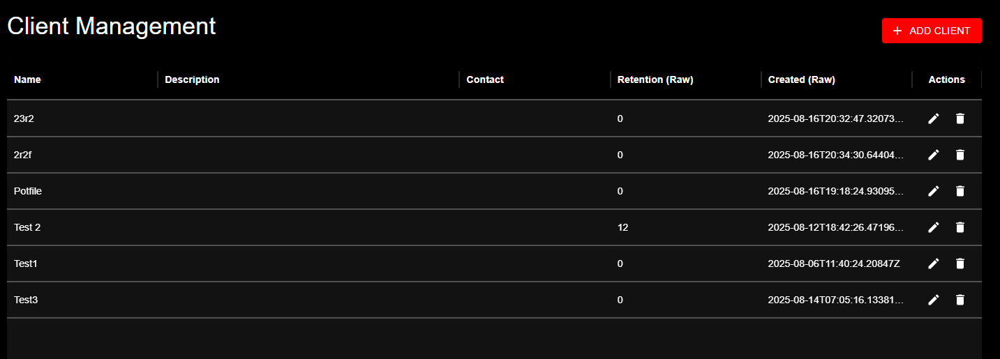

# Client Management

KrakenHashes allows associating hashlists with specific clients or engagements. This helps organize work and enables tailored settings, such as data retention policies.

## Overview

-   **Purpose:** Clients represent distinct entities (e.g., internal teams, external customers, specific penetration testing engagements) for which hashlists are managed.
-   **Association:** Hashlists can be optionally linked to a client during upload.
-   **Administration:** Administrators can create, view, update, and delete client records.


*Client Management page showing the data table with columns for Name, Description, Contact, Retention period, Creation date, and available Actions*

## Managing Clients via API

Administrators use the following API endpoints to manage clients:

-   **`GET /api/admin/clients`**
    -   **Description:** Lists all existing clients.
    -   **Response:** An array of client objects.

-   **`POST /api/admin/clients`**
    -   **Description:** Creates a new client.
    -   **Request Body (Example):**
        ```json
        {
          "name": "Project Hydra",
          "description": "Q3 Internal Assessment",
          "contact_info": "team-lead@example.com"
        }
        ```
    -   `name` is required and must be unique.
    -   `description` and `contact_info` are optional.
    -   **Response:** The newly created client object.

-   **`GET /api/admin/clients/{id}`**
    -   **Description:** Retrieves details for a specific client by its UUID.
    -   **Response:** A single client object.

-   **`PUT /api/admin/clients/{id}`**
    -   **Description:** Updates an existing client.
    -   **Request Body:** Same format as POST, but fields are optional (only provided fields are updated).
    -   **Response:** The updated client object.

-   **`DELETE /api/admin/clients/{id}`**
    -   **Description:** Deletes a client.
    -   **Important:** Deleting a client typically also involves cleaning up associated resources like hashlists or reassigning them. The exact behavior might depend on implementation details (e.g., whether associated hashlists are deleted or disassociated).
    -   **Response:** Typically a 204 No Content on success.

## Client-Specific Data Retention

Administrators can configure data retention policies specific to each client. This overrides the default system-wide retention setting (see [Data Retention](./data-retention.md)).

-   **Purpose:** Allows different retention periods for data belonging to different clients or engagements.
-   **Configuration:** Client retention settings are managed alongside other client details, likely via the `PUT /api/admin/clients/{id}` endpoint or dedicated sub-endpoints (check API definition for specifics).
    -   **Expected Fields (Example):**
        ```json
        {
          "name": "Project Hydra",
          "description": "Q3 Internal Assessment",
          // ... other client fields
          "retention_months": 30,       // Months to retain hashlists for THIS client
          "retention_override": true  // Must be true to use retention_days
        }
        ```
-   **Precedence:** Client-specific retention policy **always** takes precedence over the default policy. 