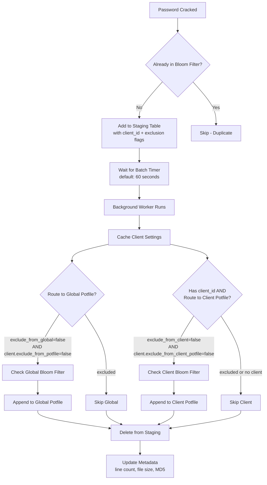

# Potfile Management

The potfile (short for "pot file" from hashcat terminology) is an automated feature in KrakenHashes that accumulates successfully cracked passwords into a specialized wordlist. This dynamic wordlist significantly improves cracking efficiency by trying previously successful passwords against new hashes.

## Table of Contents

1. [Overview](#overview)
2. [How It Works](#how-it-works)
3. [Configuration Settings](#configuration-settings)
4. [File Structure and Location](#file-structure-and-location)
5. [Staging and Processing Mechanism](#staging-and-processing-mechanism)
6. [Client Potfiles](#client-potfiles)
7. [Three-Level Cascade System](#three-level-cascade-system)
8. [Surgical Potfile Removal on Hashlist Delete](#surgical-potfile-removal-on-hashlist-delete)
9. [Integration with Jobs](#integration-with-jobs)
10. [Monitoring and Troubleshooting](#monitoring-and-troubleshooting)
11. [Best Practices](#best-practices)

## Overview

### Purpose

The potfile serves as an organizational memory of all passwords that have been successfully cracked. By maintaining this list, KrakenHashes can:

- **Accelerate future cracking**: Common passwords that worked before are likely to work again
- **Identify password reuse**: Quickly detect when the same password is used across different accounts
- **Build organizational intelligence**: Accumulate knowledge of password patterns specific to your targets
- **Optimize resource usage**: Reduce GPU time by trying known passwords first

### Key Benefits

1. **Automatic Management**: No manual intervention required - the system handles everything
2. **Real-time Updates**: Passwords are staged immediately upon cracking
3. **Deduplication**: Prevents duplicate entries automatically
4. **Distributed Access**: All agents receive the updated potfile for use in jobs
5. **Performance Optimization**: Batch processing minimizes system overhead

### Global vs. Client Potfiles

KrakenHashes maintains two types of potfiles:

- **Global Potfile**: A single system-wide potfile containing cracked passwords from all clients and hashlists (unless explicitly excluded). This is the original potfile behavior.
- **Client Potfiles**: Per-client potfiles that contain only passwords cracked from that specific client's hashlists. Each client can optionally have its own potfile, enabling client-targeted dictionary attacks.

Both potfile types are managed by the same unified background worker, use the same staging table, and share the same batch processing infrastructure. A cracked password can be written to both the global and a client potfile simultaneously, depending on the configured exclusion settings.

The routing of passwords is controlled by a **three-level cascade system** (System → Client → Hashlist), detailed in the [Three-Level Cascade System](#three-level-cascade-system) section below.

## How It Works

The potfile system operates through a multi-stage automated process:

### 1. Password Crack Detection
When an agent successfully cracks a password hash:
- The cracked password is sent to the backend server
- The backend records the crack in the database
- The password is checked against existing potfile entries

### 2. Staging Process
If the password is new (not already in the potfile):
- It's added to the `potfile_staging` table
- The entry includes the plaintext password, original hash value, and routing metadata:
  - `client_id`: The client associated with the hashlist (NULL if no client)
  - `exclude_from_global`: Whether the hashlist opts out of the global potfile
  - `exclude_from_client`: Whether the hashlist opts out of the client potfile
- Multiple passwords can accumulate in staging

### 3. Batch Processing
A single unified background worker runs periodically (default: every 60 seconds) and processes both global and client potfile entries:
- Retrieves all unprocessed entries from the staging table (including `client_id` and exclusion flags)
- Caches client settings to avoid repeated database lookups within the batch
- **Routes each entry** based on the three-level cascade:
  - **Global potfile**: Checks that the entry's `exclude_from_global` is false AND the client's `exclude_from_potfile` is false. Uses the global bloom filter for deduplication, then appends to the global potfile.
  - **Client potfile**: Checks that the entry's `exclude_from_client` is false AND the client's `exclude_from_client_potfile` is false AND the system setting `client_potfiles_enabled` is true. Uses per-client bloom filters for deduplication, then appends to the client's potfile.
- An entry can be written to both potfiles, one, or neither depending on settings
- Deletes all processed entries from the staging table (both written entries and excluded/duplicate entries)
- Updates metadata (line count, file size, MD5 hash) for both the global potfile and any affected client potfiles

### 4. Distribution
Once updated:
- The potfile's MD5 hash is recalculated
- Agents are notified of the update
- The potfile becomes available for use in cracking jobs

## Configuration Settings

The potfile feature is controlled through system settings in the database:

| Setting | Default | Description |
|---------|---------|-------------|
| `potfile_enabled` | `true` | Master switch to enable/disable the global potfile feature |
| `potfile_batch_interval` | `60` | Seconds between batch processing runs |
| `potfile_max_batch_size` | `100000` | Maximum number of entries to process in a single batch (optimized for high-volume) |
| `potfile_wordlist_id` | (auto) | Database ID of the potfile wordlist entry |
| `potfile_preset_job_id` | (auto) | Database ID of the associated preset job |
| `client_potfiles_enabled` | `true` | Master switch to enable/disable client-specific potfiles system-wide |
| `remove_from_global_potfile_on_hashlist_delete_default` | `false` | System default: whether to remove cracked passwords from the global potfile when a hashlist is deleted |
| `remove_from_client_potfile_on_hashlist_delete_default` | `false` | System default: whether to remove cracked passwords from the client potfile when a hashlist is deleted |

### Modifying Settings

Settings can be modified through direct database updates:

```sql
-- Change batch interval to 30 seconds
UPDATE system_settings 
SET value = '30' 
WHERE key = 'potfile_batch_interval';

-- Adjust max batch size (default is already optimized at 100k for high-volume)
UPDATE system_settings
SET value = '100000'
WHERE key = 'potfile_max_batch_size';

-- Disable potfile feature
UPDATE system_settings
SET value = 'false'
WHERE key = 'potfile_enabled';

-- Disable client potfiles system-wide
UPDATE system_settings
SET value = 'false'
WHERE key = 'client_potfiles_enabled';

-- Enable automatic removal from global potfile on hashlist delete (system default)
UPDATE system_settings
SET value = 'true'
WHERE key = 'remove_from_global_potfile_on_hashlist_delete_default';

-- Enable automatic removal from client potfile on hashlist delete (system default)
UPDATE system_settings
SET value = 'true'
WHERE key = 'remove_from_client_potfile_on_hashlist_delete_default';
```

> **Note**: Changes to settings require a server restart to take effect.

## File Structure and Location

### File Location
```
<data_dir>/wordlists/custom/potfile.txt
```

Typically:
```
/data/krakenhashes/wordlists/custom/potfile.txt
```

### File Format
- **Plain text file**: One password per line
- **Initial content**: Starts with a single blank line (representing an empty password)
- **Encoding**: UTF-8
- **Line endings**: Unix-style (LF)

### Example Content
```
(blank line)
password123
Admin@1234
Welcome2024!
CompanyName123
```

### Automatic Creation
- Created automatically on first server startup
- Initialized with a single blank line
- Registered as a wordlist in the database
- Associated with a preset job for easy use

> **Important**: The potfile preset job requires at least one hashcat binary version to be uploaded to the system. On fresh installations:
> - The potfile wordlist is created immediately
> - The preset job creation is deferred until a binary is available
> - A background monitor checks every 5 seconds for binary availability
> - Once a binary is uploaded, the preset job is automatically created

### Client Potfile Locations

Each client's potfile is stored within a client-specific directory:
```
<data_dir>/wordlists/clients/<client_uuid>/potfile.txt
```

Typically:
```
/data/krakenhashes/wordlists/clients/a1b2c3d4-e5f6-7890-abcd-ef1234567890/potfile.txt
```

**Directory Structure**:
```
wordlists/
├── custom/
│   └── potfile.txt              # Global potfile
└── clients/
    ├── <client-uuid-1>/
    │   ├── potfile.txt          # Client 1's potfile (auto-generated)
    │   ├── wordlist1.txt        # Client 1's uploaded wordlist
    │   └── wordlist2.txt        # Client 1's uploaded wordlist
    └── <client-uuid-2>/
        └── potfile.txt          # Client 2's potfile (auto-generated)
```

**Automatic Creation**:
- Client potfile directories and files are created automatically when the first password is routed to that client
- The directory `wordlists/clients/<uuid>/` is created on demand
- An empty potfile is created with a blank initial state
- A `client_potfiles` database record is created to track metadata (file size, line count, MD5 hash)

> **Note**: The `wordlists/clients/` directory is **not** monitored by the directory auto-import system. Files placed here manually will not be detected or imported. Client wordlists should be uploaded through the Client Management UI or API.

## Performance Optimizations (v1.2.1+)

Starting with version 1.2.1, the potfile system includes significant performance enhancements designed to handle high-volume password cracking operations efficiently.

### Bloom Filter for Duplicate Detection

The system now uses a **Bloom filter** for O(1) duplicate detection:

**Benefits**:
- **Near-instant lookups**: Check if password exists in potfile without loading entire file
- **Memory efficient**: Probabilistic data structure uses minimal RAM
- **Auto-reload**: Refreshes periodically to stay synchronized with file changes
- **Reduced disk I/O**: Avoids repeated file scanning

**How It Works**:
```
1. Bloom filter initialized on service start
2. All existing potfile entries loaded into filter
3. New passwords checked against filter before staging
4. Filter automatically reloads when potfile changes
5. False positive rate: < 0.1% (acceptable for deduplication)
```

**Impact on Performance**:
- Before: Linear scan through entire potfile (O(n))
- After: Constant-time bloom filter check (O(1))
- For 10M password potfile: 1000x faster duplicate detection

### Batch Staging API

The `StageBatch()` method enables bulk insertion of thousands of passwords in a single operation:

```go
// Stage 10,000 passwords at once with client context
entries := []PotfileStagingEntry{
    {Password: "password1", HashValue: "hash1", ClientID: &clientUUID, ExcludeFromGlobal: false, ExcludeFromClient: false},
    {Password: "password2", HashValue: "hash2", ClientID: nil, ExcludeFromGlobal: false, ExcludeFromClient: false},
    // ... 9,998 more entries
}
potfileService.StageBatch(ctx, entries)
```

**Advantages**:
- Single database round trip instead of N individual inserts
- Automatic duplicate handling with `ON CONFLICT DO NOTHING`
- Optimized for crack batching system integration
- Reduced transaction overhead

### Pre-Loaded Settings (N+1 Query Elimination)

**Problem Solved**: Previously, potfile settings were queried for every single cracked password:
```
1.75M cracks = 1.75M duplicate database queries for settings
```

**Solution**: Settings are now loaded once before processing batches:
```go
// Load once before processing batch
potfileEnabled := getSystemSetting("potfile_enabled")
clientPotfilesEnabled := getSystemSetting("client_potfiles_enabled")
hashlistExcludeGlobal := hashlist.ExcludeFromPotfile
hashlistExcludeClient := hashlist.ExcludeFromClientPotfile

// Use for all 1.75M cracks without additional queries
for _, crack := range crackedHashes {
    if potfileEnabled || clientPotfilesEnabled {
        entry := PotfileStagingEntry{
            Password:          crack.Password,
            HashValue:         crack.HashValue,
            ClientID:          hashlist.ClientID,
            ExcludeFromGlobal: hashlistExcludeGlobal,
            ExcludeFromClient: hashlistExcludeClient,
        }
        stageBatch = append(stageBatch, entry)
    }
}
```

**Impact**:
- Eliminates millions of redundant queries
- Reduces database load by >99% during bulk processing
- Faster crack processing times (seconds instead of minutes)

### Mini-Batch Transaction Processing

**For Large Crack Volumes**: The system processes cracks in mini-batches of 20,000 entries:

**Why Mini-Batching?**:
1. **Prevents Connection Leaks**: Smaller transactions complete faster
2. **Reduces Lock Contention**: Shorter transaction duration
3. **Memory Management**: Bounded memory usage per batch
4. **Better Failure Isolation**: Failed batch doesn't affect entire set

**Example**:
```
1.75M cracked passwords processed as:
- 88 transactions of 20k entries each
- vs. 1 giant transaction (prone to timeouts/locks)
- vs. 1.75M individual transactions (extreme overhead)
```

**Configuration**:
```go
// Default mini-batch size (optimized for performance)
const batchSize = 20000

// Processes 100k → 20k batches → 5 transactions
// Balances throughput with resource constraints
```

### Increased Default Batch Size

The `potfile_max_batch_size` default has been increased:
- **Old default**: 1,000 entries
- **New default**: 100,000 entries

**Rationale**:
- Modern hardware can handle larger batches efficiently
- Reduced overhead from fewer batch cycles
- Better performance during high-volume cracking (e.g., 1M+ cracks)
- Still processes in 20k mini-batches internally for safety

**When to Adjust**:
- **Increase** (>100k): Extremely high-volume environments with abundant RAM
- **Decrease** (<100k): Memory-constrained systems or very slow disks
- **Default (100k)**: Optimal for 95% of deployments

## Staging and Processing Mechanism

### Staging Table Structure

The `potfile_staging` table temporarily holds passwords before batch processing:

| Column | Type | Description |
|--------|------|-------------|
| `id` | integer | Unique identifier |
| `password` | text | The plaintext password |
| `hash_value` | text | Original hash that was cracked |
| `client_id` | UUID (nullable) | Client ID from the hashlist. NULL for entries without a client association |
| `exclude_from_global` | boolean (default false) | When true, this entry should NOT be written to the global potfile. Set from `hashlists.exclude_from_potfile` at staging time |
| `exclude_from_client` | boolean (default false) | When true, this entry should NOT be written to the client potfile. Set from `hashlists.exclude_from_client_potfile` at staging time |
| `created_at` | timestamp | When the entry was staged |
| `processed` | boolean | No longer used (entries are deleted after processing) |

### Processing Workflow



### Deduplication Logic

- **Comparison basis**: Plaintext passwords only (not hashes)
- **Case sensitivity**: Passwords are case-sensitive
- **Empty passwords**: Blank lines are valid passwords
- **Within-batch**: Duplicates within the same batch are also filtered

### Integration with Crack Batching

The potfile system is optimized to work seamlessly with the [Crack Batching System](../../reference/architecture/crack-batching-system.md):

**Workflow**:
1. Agent batches 10,000 cracked passwords
2. Backend receives `CrackBatch` message
3. Bulk lookup identifies all hashes (single query)
4. Pre-loaded potfile settings determine staging eligibility
5. `StageBatch()` inserts qualified passwords (single transaction)
6. Background worker processes staged entries in 20k mini-batches
7. Potfile updated and bloom filter refreshed

**Performance**:
- 10k cracks → potfile in <2 seconds (including bloom filter update)
- Zero N+1 query problems
- Minimal database overhead
- Automatic deduplication at multiple stages

See the [Crack Batching System](../../reference/architecture/crack-batching-system.md) documentation for full details on how high-volume cracking integrates with potfile staging.

## Client Potfiles

### Overview

Client potfiles contain passwords cracked specifically from a particular client's hashlists. They serve as a client-specific intelligence database, enabling targeted dictionary attacks using passwords known to be relevant to that client's environment.

Unlike the global potfile (which is a single file for the entire system), each client gets its own potfile at `wordlists/clients/{clientID}/potfile.txt`. This is managed automatically by the same background worker that handles the global potfile.

### When Client Potfiles Are Useful

- **Client-targeted attacks**: Use a client's own cracked passwords as a wordlist when attacking new hashlists from the same client
- **Password reuse detection**: Identify password reuse patterns within a single client's environment
- **Data isolation**: Keep one client's cracked passwords separate from another's
- **Compliance**: Some engagements require that cracked passwords are not shared across client boundaries

### How Client Potfiles Are Populated

1. When a password is cracked from a hashlist that is associated with a client, the `client_id` is recorded in the staging entry
2. The background worker evaluates the three-level cascade (see [Three-Level Cascade System](#three-level-cascade-system))
3. If the cascade permits, the password is appended to the client's potfile at `wordlists/clients/{clientID}/potfile.txt`
4. The client potfile metadata record in the `client_potfiles` table is updated with the new file size, line count, and MD5 hash

### Per-Client Bloom Filter Cache

Each client potfile has its own bloom filter for O(1) deduplication, managed via an LRU (Least Recently Used) cache:

- **Cache limit**: 50 client bloom filters maximum (`maxClientBlooms = 50`)
- **Bloom filter parameters**: 1,000,000 estimated entries per client, 1% false positive rate
- **Lazy loading**: Bloom filters are loaded from disk on first access for each client
- **LRU eviction**: When the cache is full, the least recently accessed client's bloom filter is evicted
- **Evicted filters**: Are reloaded from disk on next access (no data loss, just a disk read)
- **Update behavior**: New passwords are added to the bloom filter immediately after being written to the potfile

**Memory impact**: Each bloom filter uses approximately 1.2 MB of memory. With 50 clients cached, this is approximately 60 MB of memory dedicated to client bloom filters.

### Viewing Client Potfile Information

Client potfile metadata can be retrieved via API:

```
GET /api/clients/{client_id}/potfile
```

Response:
```json
{
  "id": 1,
  "client_id": "a1b2c3d4-e5f6-7890-abcd-ef1234567890",
  "file_path": "/data/krakenhashes/wordlists/clients/a1b2c3d4-.../potfile.txt",
  "file_size": 45678,
  "line_count": 3421,
  "md5_hash": "abc123def456...",
  "created_at": "2025-01-15T10:30:00Z",
  "updated_at": "2025-01-20T14:22:00Z"
}
```

### Downloading Client Potfiles

The potfile can be downloaded via:

```
GET /api/clients/{client_id}/potfile/download
```

This returns the raw potfile as a text file.

### Using Client Potfiles in Jobs

When creating a job for a hashlist associated with a client, the wordlist selection dropdown in the Create Job dialog shows a **"Client Specific"** category above the **"Global"** category. The client potfile appears in the Client Specific section as:

```
Client Potfile (3,421 passwords) - 44.6 KB
```

Selecting it adds the potfile as a wordlist using the internal ID format `potfile:{id}`. The backend resolves this to the correct file path when dispatching tasks to agents.

### Agent Download Behavior

Agents handle client potfiles differently from regular wordlists:

- **Always fresh**: Client potfiles are **deleted and re-downloaded** before each task assignment. This ensures agents always have the latest passwords, since client potfiles can be updated between tasks.
- **Storage location**: Stored locally at `wordlists/clients/{clientID}/potfile.txt` within the agent's data directory
- **Download endpoint**: Agents download via the agent file sync API using API key authentication

This contrasts with regular wordlists and client wordlists, which are cached locally and only re-downloaded when their MD5 hash changes.

## Three-Level Cascade System

The cascade system determines whether a cracked password is written to the global potfile, a client potfile, both, or neither. All three levels must permit writing for a password to reach a given potfile.

### Cascade Levels

| Level | Scope | Global Potfile Control | Client Potfile Control |
|-------|-------|----------------------|----------------------|
| **1. System** | All clients, all hashlists | `potfile_enabled` system setting | `client_potfiles_enabled` system setting |
| **2. Client** | All hashlists for this client | `clients.exclude_from_potfile` column | `clients.exclude_from_client_potfile` column |
| **3. Hashlist** | This specific hashlist only | `hashlists.exclude_from_potfile` column | `hashlists.exclude_from_client_potfile` column |

### Cascade Decision Logic

For a cracked password to be written to the **global potfile**, ALL of these must be true:
1. System setting `potfile_enabled` = `true`
2. Client's `exclude_from_potfile` = `false` (or hashlist has no client)
3. Hashlist's `exclude_from_potfile` = `false`

For a cracked password to be written to a **client potfile**, ALL of these must be true:
1. System setting `client_potfiles_enabled` = `true`
2. The hashlist is associated with a client (has a non-NULL `client_id`)
3. Client's `exclude_from_client_potfile` = `false`
4. Hashlist's `exclude_from_client_potfile` = `false`

### Decision Table

| System Global | Client Exclude Global | Hashlist Exclude Global | System Client | Client Exclude Client | Hashlist Exclude Client | → Global? | → Client? |
|:---:|:---:|:---:|:---:|:---:|:---:|:---:|:---:|
| true | false | false | true | false | false | **YES** | **YES** |
| true | false | false | true | false | true | **YES** | NO |
| true | false | true | true | false | false | NO | **YES** |
| true | true | false | true | false | false | NO | **YES** |
| true | false | false | false | false | false | **YES** | NO |
| false | false | false | true | false | false | NO | **YES** |
| true | true | true | true | true | true | NO | NO |

### Semantics: "Exclude" Pattern

All exclusion flags use **"exclude" semantics** consistently:
- `exclude_from_potfile = false` means "include in the global potfile" (default)
- `exclude_from_potfile = true` means "do NOT include in the global potfile"
- `exclude_from_client_potfile = false` means "include in the client potfile" (default)
- `exclude_from_client_potfile = true` means "do NOT include in the client potfile"

This pattern was chosen for consistency across all three levels (system, client, hashlist) and to make the default behavior (writing to potfiles) the zero/false value.

### Where Exclusion Flags Are Set

- **System level**: Via `system_settings` table, manageable through Admin UI or direct database updates
- **Client level**: Via the Client Management page (Admin → Clients → Edit), stored in the `clients` table
- **Hashlist level**: Via the hashlist upload form, where two separate checkboxes appear:
  - "Exclude from global potfile"
  - "Exclude from client potfile"

### Implementation Detail: Staging-Time Capture

Exclusion flags are captured at staging time (when the password is first recorded in `potfile_staging`), not at processing time. This means:
- The `exclude_from_global` and `exclude_from_client` columns on `potfile_staging` are snapshots of the hashlist's settings at the moment the crack was staged
- Changing a hashlist's exclusion flag after cracks have been staged does NOT retroactively affect those staged entries
- The client-level exclusion check happens at processing time (when the background worker runs), so client setting changes take effect on the next batch processing cycle

## Surgical Potfile Removal on Hashlist Delete

When a hashlist is deleted, the system can optionally remove that hashlist's cracked passwords from the global potfile and/or client potfile. This is controlled independently for each potfile type through a three-tier settings cascade.

### Removal Settings Cascade

For each potfile type (global and client), the system evaluates settings in this order:

1. **System default** (`system_settings` table):
   - `remove_from_global_potfile_on_hashlist_delete_default` (default: `false`)
   - `remove_from_client_potfile_on_hashlist_delete_default` (default: `false`)

2. **Client override** (`clients` table):
   - `remove_from_global_potfile_on_hashlist_delete`: NULL = use system default, true = always remove, false = never remove
   - `remove_from_client_potfile_on_hashlist_delete`: NULL = use system default, true = always remove, false = never remove
   - When a client override is set (non-NULL), it **forces** the behavior and the user cannot change it at delete time

3. **User ad-hoc choice** (delete confirmation dialog):
   - Only available when the client override is NULL (using system default)
   - The delete confirmation dialog shows checkboxes pre-populated with the effective default
   - User can toggle the checkboxes to override for this specific deletion

### Eligibility

Removal is only offered when cracks WERE actually written to the potfile. Eligibility requires:

- **Global potfile removal**: `potfile_enabled` is `true` AND the client's `exclude_from_potfile` is `false`
- **Client potfile removal**: `client_potfiles_enabled` is `true` AND the client's `exclude_from_client_potfile` is `false`

If the hashlist has no client association, only global potfile removal is evaluated.

### How Removal Works

#### Global Potfile Removal

1. **Before deletion**: The system queries for plaintexts that are UNIQUE to the hashlist being deleted (not present in any other hashlist that contributes to the global potfile)
2. The hashlist is then deleted from the database
3. **After deletion**: The unique plaintexts are removed from the global potfile file using a stream-filter approach with atomic file rename
4. The global bloom filter is rebuilt asynchronously

#### Client Potfile Removal

1. The hashlist is deleted from the database
2. The client potfile is **regenerated from scratch** by querying all unique cracked plaintexts from the client's REMAINING hashlists
3. The regenerated file replaces the old potfile via atomic rename
4. The client's bloom filter is rebuilt from the new file contents
5. The client potfile metadata is updated

> **Important**: The uniqueness check for global removal happens BEFORE the hashlist is deleted from the database, because the foreign key relationships are needed to determine which plaintexts are unique to that hashlist. Client potfile regeneration happens AFTER deletion, because it queries the remaining hashlists.

### API: Delete with Potfile Removal

The `DELETE /api/hashlists/{id}` endpoint accepts an optional JSON body:

```json
{
  "remove_from_global_potfile": true,
  "remove_from_client_potfile": true
}
```

Both fields are optional. When omitted, the system uses the effective default from the settings cascade.

### Example Scenarios

**Scenario 1: Standard delete, no removal**
- System defaults: both `false`
- Client overrides: both `NULL`
- User deletes without checking any removal boxes
- Result: Hashlist deleted, potfiles unchanged

**Scenario 2: Client enforces removal**
- Client `remove_from_client_potfile_on_hashlist_delete` = `true`
- User deletes the hashlist
- Result: Client potfile is automatically regenerated without the deleted hashlist's passwords. User cannot override this behavior.

**Scenario 3: Ad-hoc removal**
- System defaults: both `false`
- Client overrides: both `NULL`
- User checks "Remove from global potfile" in the delete dialog
- Result: Unique passwords from the deleted hashlist are surgically removed from the global potfile

## Integration with Jobs

### Automatic Preset Job

The system automatically creates a preset job for the potfile:
- **Name**: "Potfile Run"
- **Type**: Dictionary attack using the potfile as the wordlist
- **Priority**: Can be configured for high-priority execution
- **Agents**: Available to all agents

> **Note**: If you don't see the "Potfile Run" preset job after installation, ensure you have uploaded at least one hashcat binary through Admin → Binary Management. The preset job will be created automatically once a binary is available.

### Using the Potfile in Jobs

1. **Automatic inclusion**: The potfile preset job can be included in job workflows
2. **Manual selection**: Administrators can select the potfile wordlist when creating custom jobs
3. **First-pass attack**: Often used as the first attack in a workflow due to high success rate

### Keyspace Calculation

- The potfile's word count is automatically updated after each batch
- Keyspace for jobs using the potfile adjusts dynamically
- Agents receive updated keyspace information

## Monitoring and Troubleshooting

### Check Potfile Status

```bash
# View potfile contents
cat /data/krakenhashes/wordlists/custom/potfile.txt

# Count passwords in potfile
wc -l /data/krakenhashes/wordlists/custom/potfile.txt

# Check file size
ls -lh /data/krakenhashes/wordlists/custom/potfile.txt
```

### Check Client Potfile Status

```bash
# List all client potfile directories
ls -la /data/krakenhashes/wordlists/clients/

# View a specific client's potfile
cat /data/krakenhashes/wordlists/clients/<client-uuid>/potfile.txt

# Count passwords in a client's potfile
wc -l /data/krakenhashes/wordlists/clients/<client-uuid>/potfile.txt

# Check all client potfile sizes
find /data/krakenhashes/wordlists/clients/ -name potfile.txt -exec ls -lh {} \;
```

```sql
-- View all client potfile metadata
SELECT cp.client_id, c.name as client_name, cp.line_count, cp.file_size, cp.updated_at
FROM client_potfiles cp
JOIN clients c ON cp.client_id = c.id
ORDER BY cp.line_count DESC;

-- Check for clients without potfiles
SELECT c.id, c.name, c.exclude_from_client_potfile
FROM clients c
LEFT JOIN client_potfiles cp ON c.id = cp.client_id
WHERE cp.id IS NULL AND c.exclude_from_client_potfile = false;
```

### Monitor Staging Table

```sql
-- Count staged entries
SELECT COUNT(*) FROM potfile_staging;

-- View recent staged passwords
SELECT password, created_at 
FROM potfile_staging 
ORDER BY created_at DESC 
LIMIT 10;

-- Check for processing issues
SELECT COUNT(*) as stuck_entries
FROM potfile_staging
WHERE created_at < NOW() - INTERVAL '1 hour';

-- View staged entries with client routing information
SELECT password, client_id, exclude_from_global, exclude_from_client, created_at
FROM potfile_staging
ORDER BY created_at DESC
LIMIT 10;

-- Count staged entries by destination
SELECT
    CASE WHEN client_id IS NULL THEN 'no-client' ELSE 'client:' || client_id::text END as source,
    SUM(CASE WHEN exclude_from_global = false THEN 1 ELSE 0 END) as for_global,
    SUM(CASE WHEN client_id IS NOT NULL AND exclude_from_client = false THEN 1 ELSE 0 END) as for_client,
    COUNT(*) as total
FROM potfile_staging
GROUP BY CASE WHEN client_id IS NULL THEN 'no-client' ELSE 'client:' || client_id::text END;
```

### Check Processing Logs

```bash
# View potfile-related logs
docker logs krakenhashes 2>&1 | grep -i potfile

# Check for staging activity
docker logs krakenhashes 2>&1 | grep "staged password"

# Monitor batch processing
docker logs krakenhashes 2>&1 | grep "Processing.*staged pot-file entries"
```

### Common Issues and Solutions

| Issue | Cause | Solution |
|-------|-------|----------|
| Passwords not being added | Potfile disabled | Check `potfile_enabled` setting |
| Staging table growing | Processing stopped | Restart server, check logs for errors |
| Duplicate passwords appearing | File manually edited | Let system manage the file |
| Potfile not updating | Batch interval too long | Reduce `potfile_batch_interval` |
| High memory usage | Large potfile | Consider archiving old entries |
| Potfile preset job missing | No binaries uploaded | Upload a hashcat binary via Binary Management |
| Client potfile not being created | Client potfiles disabled or client excluded | Check `client_potfiles_enabled` setting and `clients.exclude_from_client_potfile` |
| Client potfile missing passwords | Hashlist excluded from client potfile | Check `hashlists.exclude_from_client_potfile` for relevant hashlists |
| Client bloom filter using too much memory | Many active clients | Reduce `maxClientBlooms` (default 50) or restart to clear cache |

## Best Practices

### Operational Guidelines

1. **Let the system manage the potfile**
   - Don't manually edit while the server is running
   - Use the staging mechanism for all additions
   - Trust the deduplication logic

2. **Monitor staging table size**
   ```sql
   -- Set up an alert if staging exceeds threshold
   SELECT COUNT(*) FROM potfile_staging;
   ```

3. **Balance batch processing**
   - Shorter intervals: More responsive but higher overhead
   - Longer intervals: More efficient but delayed updates
   - Recommended: 30-60 seconds for most deployments

4. **Regular maintenance**
   - Monitor potfile size growth
   - Consider rotating very large potfiles (>1GB)
   - Archive historical passwords if needed

### Performance Considerations

- **Memory usage**: The entire potfile is loaded into memory during processing
- **Disk I/O**: Frequent updates can cause disk activity
- **Network transfer**: Large potfiles take time to sync to agents
- **Database load**: Staging table operations add database activity

### Security Notes

> **Important**: The potfile contains actual passwords in plaintext

- Protect the potfile with appropriate file permissions
- Ensure backups are encrypted
- Limit access to the system data directory
- Consider compliance requirements for password storage
- Implement audit logging for potfile access

!!! danger "Data Retention Exclusion"
    The potfile is **NOT** managed by the data retention system. This has critical security and compliance implications:

    **What This Means:**
    - Passwords from deleted hashlists remain in the potfile permanently
    - The potfile grows indefinitely unless manually managed
    - Deleting a client or hashlist does NOT remove their passwords from the potfile
    - This applies to BOTH the global potfile and client potfiles
    - Client potfiles are also NOT managed by the data retention system
    - This may violate data protection regulations (GDPR, CCPA, etc.) that require complete data deletion

    **Required Manual Management:**
    1. **Implement a cleanup procedure** to remove passwords associated with deleted hashlists
    2. **Document your potfile retention policy** separately from the main data retention policy
    3. **Consider periodic rotation** - archive old potfiles and start fresh
    4. **Audit compliance** - ensure your potfile management meets regulatory requirements
    5. **Track deletions** - maintain logs of when and why potfile entries were removed

    **Mitigation via Surgical Removal:**
    The [surgical potfile removal on hashlist delete](#surgical-potfile-removal-on-hashlist-delete) feature provides a built-in mechanism to address this concern:
    - Configure `remove_from_global_potfile_on_hashlist_delete_default` and `remove_from_client_potfile_on_hashlist_delete_default` to `true` to automatically remove passwords when hashlists are deleted
    - Set per-client overrides via `clients.remove_from_global_potfile_on_hashlist_delete` and `clients.remove_from_client_potfile_on_hashlist_delete` for specific compliance requirements
    - Users can also choose removal ad-hoc at delete time via the delete confirmation dialog

    **Example Cleanup Approach:**
    ```bash
    # Backup current potfile
    cp /data/krakenhashes/wordlists/custom/potfile.txt potfile.backup

    # Remove specific patterns (requires careful scripting)
    grep -v "pattern_to_remove" potfile.txt > potfile.tmp
    mv potfile.tmp potfile.txt

    # Or rotate periodically
    mv potfile.txt potfile.$(date +%Y%m%d).archive
    echo "" > potfile.txt  # Start with blank line
    ```

### Backup and Recovery

1. **Include in backups**: The potfile should be part of regular system backups
2. **Database consistency**: Back up both the potfile and database together
3. **Recovery process**: 
   - Restore the potfile to its original location
   - Verify the `potfile_wordlist_id` matches the database
   - Clear any orphaned staging entries
   - Restart the server

### Integration Tips

- **Workflow optimization**: Place potfile attack early in job workflows
- **Custom rules**: Combine potfile with rule-based attacks for variations
- **Hybrid attacks**: Use potfile + mask attacks for pattern matching
- **Regular updates**: Ensure agents sync regularly for latest passwords

## Advanced Usage

### Manual Staging

If needed, passwords can be manually staged:

```sql
-- Stage a password for global potfile only (no client)
INSERT INTO potfile_staging (password, hash_value, client_id, exclude_from_global, exclude_from_client, created_at, processed)
VALUES ('NewPassword123', 'manual_entry', NULL, false, false, NOW(), false);

-- Stage a password for a specific client's potfile
INSERT INTO potfile_staging (password, hash_value, client_id, exclude_from_global, exclude_from_client, created_at, processed)
VALUES ('NewPassword123', 'manual_entry', 'client-uuid-here', false, false, NOW(), false);
```

### Bulk Import

For importing existing password lists:

```sql
-- Import from external source (use with caution)
INSERT INTO potfile_staging (password, hash_value, created_at, processed)
SELECT DISTINCT password, 'bulk_import', NOW(), false
FROM external_password_source
WHERE password NOT IN (
    SELECT line FROM potfile_lines
);
```

### Potfile Analysis

```sql
-- Most recent additions
SELECT password, created_at 
FROM potfile_staging 
ORDER BY created_at DESC 
LIMIT 20;

-- Processing rate
SELECT 
    DATE_TRUNC('hour', created_at) as hour,
    COUNT(*) as passwords_staged
FROM potfile_staging
WHERE created_at > NOW() - INTERVAL '24 hours'
GROUP BY hour
ORDER BY hour;
```

## Summary

The potfile is a powerful feature that automatically builds organizational knowledge of successful passwords. By accumulating cracked passwords and making them available for future jobs, it significantly improves cracking efficiency over time. The automated staging and batch processing system ensures reliable operation with minimal administrative overhead.

Key points to remember:
- Fully automated operation with configurable parameters
- Intelligent deduplication prevents redundant entries
- Seamless integration with the job system
- Minimal performance impact through batch processing
- Critical asset for improving crack rates over time
- Client potfiles provide per-client password intelligence for targeted attacks
- Three-level cascade (System → Client → Hashlist) controls password routing
- Surgical removal on hashlist delete enables compliance with data protection requirements

For additional assistance or advanced configuration needs, consult the system logs or contact support.