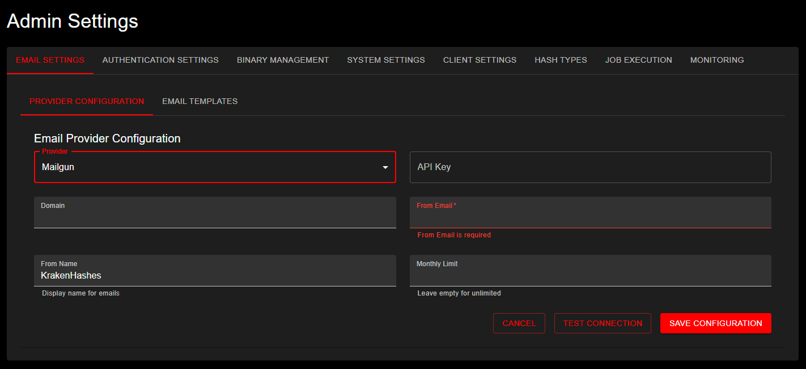

# Email Settings Administration

## Overview
KrakenHashes supports email functionality through multiple providers: SendGrid, Mailgun, and SMTP. This document covers the configuration and management of email settings through the admin interface.

## Provider Configuration

*Admin Settings Email Configuration page showing Mailgun provider setup with API Key, Domain, From Name, From Email, and Monthly Limit fields*

### SendGrid
To configure SendGrid as your email provider:

1. Select "SendGrid" from the Provider dropdown
2. Configure the following fields:
   - **API Key**: Your SendGrid API key with email sending permissions
   - **From Email**: The verified sender email address
   - **From Name**: Display name for the sender (defaults to "KrakenHashes")
   - **Monthly Limit**: (Optional) Set a monthly email sending limit
   
### Mailgun
To configure Mailgun as your email provider:

1. Select "Mailgun" from the Provider dropdown
2. Configure the following fields:
   - **API Key**: Your Mailgun API key
   - **Domain**: Your verified Mailgun domain
   - **From Email**: The verified sender email address
   - **From Name**: Display name for the sender (defaults to "KrakenHashes")
   - **Monthly Limit**: (Optional) Set a monthly email sending limit

### SMTP
To configure a custom SMTP server as your email provider:

1. Select "SMTP" from the Provider dropdown
2. Configure the following fields:
   - **Host**: Your SMTP server hostname (e.g., `smtp.gmail.com`, `smtp.office365.com`)
   - **Port**: SMTP server port (auto-selected based on encryption if not specified)
   - **Username**: SMTP authentication username
   - **Password**: SMTP authentication password
   - **From Email**: The sender email address
   - **From Name**: Display name for the sender (defaults to "KrakenHashes")
   - **Encryption**: Select encryption mode:
     - **None**: Plain SMTP without encryption (port 25, not recommended for production)
     - **STARTTLS**: Start with plain connection and upgrade to TLS (port 587, recommended)
     - **TLS/SSL**: Direct TLS connection (port 465, legacy but widely supported)
   - **Skip TLS Verify**: ⚠️ Only enable for self-signed certificates (security risk)

#### SMTP Configuration Notes

**Default Ports:**
- None (no encryption): Port 25
- STARTTLS: Port 587 (recommended for most providers)
- TLS/SSL: Port 465 (implicit TLS)

**Connection Timeouts:**
- All SMTP connections have a 30-second timeout to prevent indefinite hanging
- If connection fails, check firewall rules and server availability

**Password Management:**
- When updating existing SMTP configuration, you can leave the password field empty to keep the current password
- The password is stored securely and displayed as `[REDACTED]` in the UI
- Only enter a password when creating new configuration or changing the existing password

**Supported SMTP Providers:**
- Gmail (requires App Password if 2FA enabled)
- Office 365 / Outlook.com
- Custom mail servers
- Self-hosted SMTP servers

**Security Warning:**
- The "Skip TLS Verify" option should only be used for self-signed certificates in trusted environments
- Always use STARTTLS or TLS/SSL encryption in production
- Never use "None" encryption for production email

### Monthly Limit
The monthly limit field is optional:
- Leave empty for unlimited emails
- Set a numeric value to limit monthly email sending
- Helps prevent unexpected costs from email service providers

## Testing and Saving Configuration

### Configuration Options
When saving email provider settings, you have three options:

1. **Cancel**: Discard changes and return to previous settings
2. **Save Configuration**: Save settings without testing
3. **Test and Save**: Test the configuration before saving

### Testing Process
When using "Test and Save":

1. Enter a test email address
2. System sends a test email to verify configuration
3. If successful:
   - Configuration is saved
   - Confirmation message displayed
4. If failed:
   - Error message displayed
   - Configuration not saved
   - Troubleshooting information provided

## Email Templates
Email templates are managed separately from provider configuration.

## Best Practices

1. **Provider Selection**
   - Choose based on your volume needs
   - Consider provider-specific features
   - Review pricing structures

2. **Configuration Testing**
   - Always test configuration before deployment
   - Verify emails are received
   - Check spam folder during testing

3. **Monthly Limits**
   - Set based on expected usage
   - Include buffer for unexpected spikes
   - Monitor usage through provider dashboards

4. **Security Considerations**
   - Store API keys securely
   - Use dedicated sending domains
   - Regularly rotate API keys
   - Monitor for unusual activity

## Troubleshooting

### Common Issues

1. **Emails Not Sending**
   - Verify API key permissions
   - Check monthly limit hasn't been reached
   - Confirm sender email is verified
   - Review provider dashboard for blocks

2. **Test Emails Failing**
   - Verify API key is correct (SendGrid, Mailgun)
   - Verify SMTP credentials are correct (SMTP)
   - Check domain configuration (Mailgun)
   - Check port and encryption settings (SMTP)
   - Ensure test email address is valid
   - Review error messages in admin interface

3. **SMTP Connection Issues**
   - Verify hostname is correct and reachable
   - Check if port is blocked by firewall
   - Confirm encryption mode matches server requirements
   - For Gmail: Use App Password, not account password
   - For Office 365: Ensure SMTP AUTH is enabled
   - Connection timeout (30 seconds) may indicate network issues

4. **Template Issues**
   - Verify template syntax
   - Check variable names match expected format
   - Preview templates before saving
   - Test with various data scenarios 