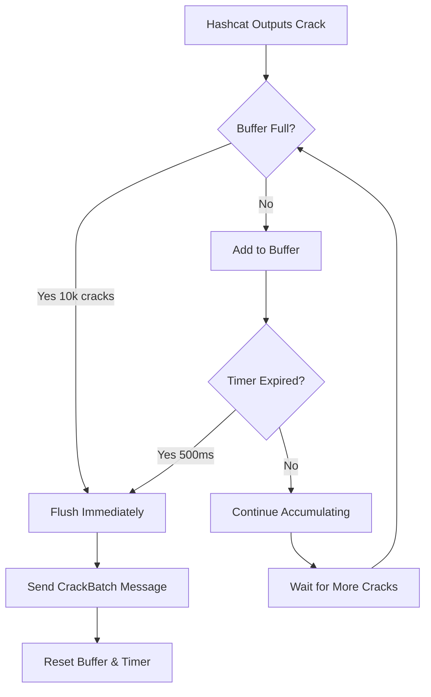
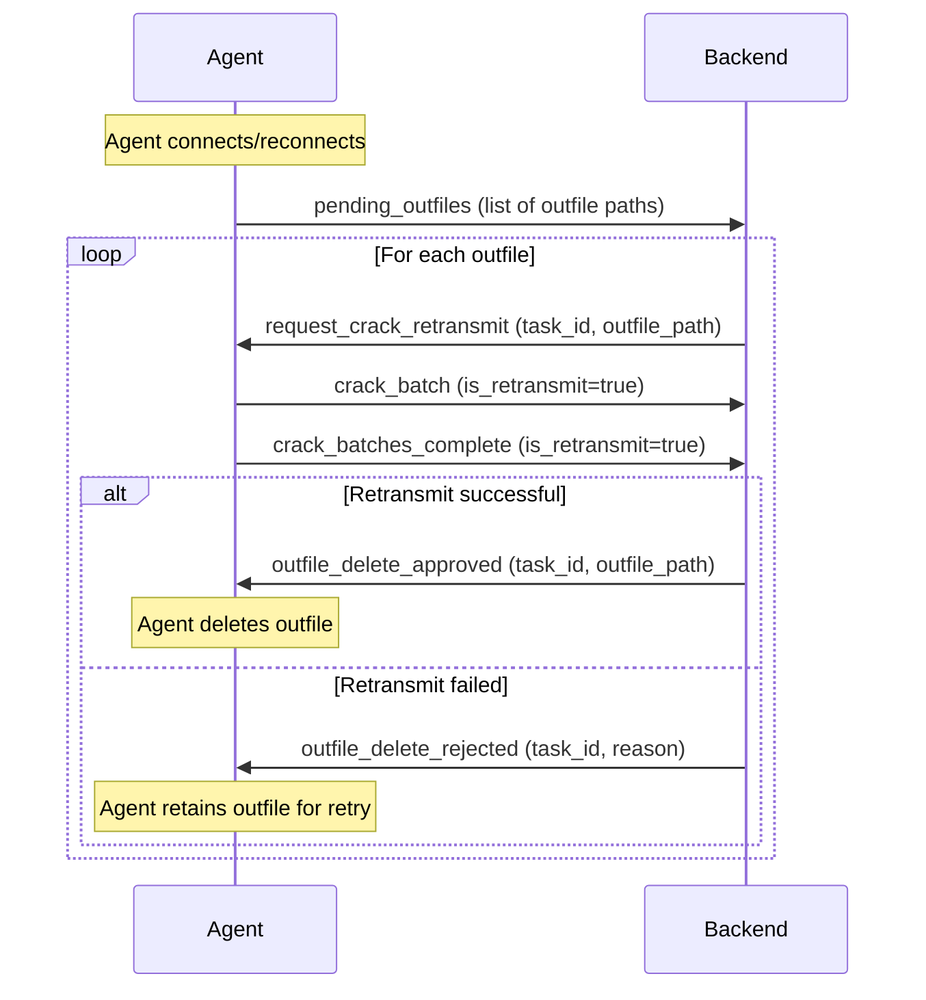

# Crack Batching System

## Overview

The crack batching system is a critical performance optimization that prevents agent crashes and message flooding during high-volume password cracking operations. By batching cracked passwords before transmission and implementing a dual-channel architecture, the system achieves a **100x reduction in message volume** while maintaining zero data loss.

## The Problem

Prior to the crack batching implementation, agents faced severe issues during high-volume cracking:

### Message Flood Scenario
- **Volume**: When thousands of hashes crack simultaneously (e.g., 4,000+ in seconds)
- **Individual Messages**: Each crack generated a separate WebSocket message
- **Channel Overflow**: 256-message outbound buffer would fill instantly
- **Agent Crashes**: Buffer overflow caused panic and agent disconnection
- **Data Loss Risk**: Cracked passwords could be lost during crashes

### Real-World Impact
```
Before: 4,000 cracks = 8,000+ WebSocket messages
After:  4,000 cracks = 80 batched messages (100x reduction)
```

## Architecture

### Dual-Channel Message System

The system separates status updates from crack data transmission:

#### 1. Status Channel (Synchronous)
**Purpose**: Real-time job progress without crack payload

**Message Type**: `JobStatus`
```json
{
  "task_id": "uuid",
  "keyspace_processed": 1234567,
  "progress_percent": 45.2,
  "hash_rate": 1500000000,
  "cracked_count": 150,
  "device_metrics": [...],
  "status": "running"
}
```

**Characteristics**:
- Sent every progress update interval
- Contains only crack **count**, not actual data
- Lightweight for real-time UI updates
- Includes all performance metrics

#### 2. Crack Channel (Asynchronous)
**Purpose**: Batched transmission of actual cracked passwords

**Message Type**: `CrackBatch`
```json
{
  "task_id": "uuid",
  "is_retransmit": false,
  "cracked_hashes": [
    {
      "hash": "5f4dcc3b5aa765d61d8327deb882cf99",
      "plaintext": "password",
      "original_line": "user:5f4dcc3b5aa765d61d8327deb882cf99"
    },
    ...
  ]
}
```

**Characteristics**:
- Sent in batches (10,000 cracks or 500ms window)
- Independent from progress updates
- Optimized for bulk database operations
- Preserves all crack metadata

### Batching Parameters

| Parameter | Value | Purpose |
|-----------|-------|---------|
| **Batch Window** | 500ms | Time to accumulate cracks before flush |
| **Buffer Size** | 10,000 cracks | Maximum cracks per batch |
| **Channel Buffer** | 4,096 messages | Agent outbound message queue |
| **WebSocket Max** | 50MB | Maximum message size (backend) |

### Batching Logic



## Implementation Details

### Agent-Side Processing

#### Crack Detection and Buffering

**Location**: `agent/internal/jobs/hashcat_executor.go`

1. **Outfile Monitoring**
   - Hashcat writes cracks to `--outfile`
   - Agent monitors file with offset tracking
   - New lines detected via polling (every 100ms)

2. **Deduplication**
   ```go
   // Track sent cracks to prevent duplicates
   OutfileSentHashes map[string]bool

   // Key format: "hash:plaintext"
   lineKey := fmt.Sprintf("%s:%s", hash, plaintext)
   if !process.OutfileSentHashes[lineKey] {
       process.OutfileSentHashes[lineKey] = true
       // Add to batch buffer
   }
   ```

3. **Batch Buffer Management**
   ```go
   // Initialize buffer with 10k capacity
   crackBatchBuffers[taskID] = make([]CrackedHash, 0, 10000)

   // Add crack to buffer
   crackBatchBuffers[taskID] = append(crackBatchBuffers[taskID], crack)

   // Check flush conditions
   if len(crackBatchBuffers[taskID]) >= 10000 {
       flushCrackBatchLocked(process)
   }
   ```

4. **Timer-Based Flushing**
   ```go
   // 500ms batching window
   timer := time.NewTimer(500 * time.Millisecond)
   crackBatchTimers[taskID] = timer

   // Flush on timer expiration
   <-timer.C
   flushCrackBatchLocked(process)
   ```

#### Message Transmission

**Connection Management**: `agent/internal/agent/connection.go`

1. **Increased Channel Buffer**
   ```go
   // Old: 256 messages
   // New: 4096 messages (16x capacity)
   outbound: make(chan []byte, 4096)
   ```

2. **Channel Monitoring**
   ```go
   // Monitor buffer fullness
   fullness := float64(len(ac.outbound)) / float64(cap(ac.outbound)) * 100

   if fullness >= 90.0 {
       logger.Error("Outbound channel critically full (%.1f%%)", fullness)
   } else if fullness >= 75.0 {
       logger.Warning("Outbound channel filling up (%.1f%%)", fullness)
   }
   ```

3. **Graceful Drop Handling**
   ```go
   select {
   case ac.outbound <- message:
       // Message queued successfully
   default:
       // Channel full - log and drop
       logger.Error("Dropped message - channel full (%.1f%%)", fullness)
   }
   ```

### Backend-Side Processing

#### Crack Batch Handler

**Location**: `backend/internal/integration/job_websocket_integration.go`

**New Handler Function**:
```go
func (s *JobWebSocketIntegration) HandleCrackBatch(
    ctx context.Context,
    agentID int,
    crackBatch *models.CrackBatch,
) error {
    // Validate task exists and belongs to agent
    task := s.jobTaskRepo.GetByID(ctx, crackBatch.TaskID)

    // Process cracks in optimized batches
    err := s.processCrackedHashes(ctx, crackBatch.TaskID, crackBatch.CrackedHashes)

    return err
}
```

#### Optimized Bulk Processing

1. **Single Bulk Lookup**
   ```go
   // OLD: N individual queries (1.75M cracks = 1.75M queries)
   for _, crack := range crackedHashes {
       hash := hashRepo.GetByHashValue(crack.Hash)
   }

   // NEW: One bulk query
   allHashes := hashRepo.GetByHashValues(allHashValues)
   ```

2. **Mini-Batch Transactions**
   ```go
   // Process in 20k chunks to prevent connection leaks
   const batchSize = 20000
   for i := 0; i < len(updates); i += batchSize {
       batch := updates[i:min(i+batchSize, len(updates))]
       tx := db.Begin()
       // Process batch
       tx.Commit()
   }
   ```

3. **Pre-Loaded Settings**
   ```go
   // OLD: Query settings for every crack (N+1 problem)
   for _, crack := range crackedHashes {
       potfileEnabled := getSystemSetting("potfile_enabled")
   }

   // NEW: Load once before loop
   potfileEnabled := getSystemSetting("potfile_enabled")
   for _, crack := range crackedHashes {
       // Use pre-loaded value
   }
   ```

#### WebSocket Configuration

**Location**: `backend/internal/handlers/websocket/handler.go`

```go
// Increased from 512KB to support large batches
maxMessageSize = 50 * 1024 * 1024  // 50MB
```

**Capacity Calculation**:
- 10,000 cracks/batch
- ~500 bytes/crack (with metadata)
- ~5MB total per batch
- 50MB max provides 10x safety margin

## Performance Impact

### Message Reduction

| Scenario | Before | After | Reduction |
|----------|--------|-------|-----------|
| 4,000 cracks | 8,000+ messages | 80 messages | 100x |
| 100,000 cracks | 200,000+ messages | 100 messages | 2000x |
| 1M cracks | 2M+ messages | 100 messages | 20000x |

### Network Efficiency

1. **WebSocket Frame Batching**
   - Multiple small messages → Frequent frame overhead
   - Large batched messages → Amortized frame cost
   - Compression works better on larger payloads

2. **Database Efficiency**
   - Individual inserts → N round trips
   - Bulk operations → Single round trip
   - Transaction overhead reduced by 99%+

3. **CPU Utilization**
   - Serialization overhead reduced
   - Fewer context switches
   - Better cache locality

## Monitoring and Observability

### Agent-Side Metrics

**Channel Fullness Warnings**:
```
[WARNING] Outbound channel filling up (78.2%)
[ERROR] Outbound channel critically full (92.5%)
[ERROR] Dropped message - channel full (95.0%)
```

**Batch Flush Events**:
```
[INFO] Crack batch buffer reached size limit for task abc-123 (10000 cracks), flushing immediately
[DEBUG] Flushing crack batch for task abc-123: 523 cracks
```

### Backend-Side Metrics

**Batch Processing Logs**:
```
[INFO] Processing crack batch from agent 5: task=abc-123, crack_count=8472
[DEBUG] Bulk lookup found 8472 hashes in database
[INFO] Processed 8472 cracked hashes in 2.3 seconds
```

**Performance Tracking**:
```sql
-- Monitor batch processing times
SELECT
    DATE_TRUNC('minute', timestamp) as minute,
    COUNT(*) as batch_count,
    AVG(crack_count) as avg_cracks_per_batch,
    AVG(processing_time_ms) as avg_processing_ms
FROM crack_batch_metrics
WHERE timestamp > NOW() - INTERVAL '1 hour'
GROUP BY minute
ORDER BY minute DESC;
```

## Error Handling and Recovery

### Agent Crash Protection

1. **Outfile Offset Tracking**
   - Persistent offset prevents duplicate sends
   - Recovery from agent restart
   - No crack data loss

2. **Timer Cleanup**
   ```go
   // Stop timers on task cancellation
   if timer := crackBatchTimers[taskID]; timer != nil {
       timer.Stop()
       delete(crackBatchTimers, taskID)
   }
   ```

3. **Buffer Cleanup**
   ```go
   // Flush remaining cracks before exit
   defer func() {
       if len(crackBatchBuffers[taskID]) > 0 {
           flushCrackBatchLocked(process)
       }
   }()
   ```

### Backend Resilience

1. **Task Validation**
   - Verify task exists before processing
   - Check agent ownership
   - Ignore orphaned batches

2. **Transaction Safety**
   ```go
   tx, err := db.Begin()
   if err != nil {
       return fmt.Errorf("failed to start transaction: %w", err)
   }
   defer tx.Rollback() // Rollback on error

   // Process batch
   if err := processBatch(tx, batch); err != nil {
       return err
   }

   return tx.Commit()
   ```

3. **Graceful Degradation**
   - Individual crack failures don't stop batch
   - Partial success logged and tracked
   - Retry logic for transient errors

## Interaction with Other Systems

### Potfile Integration

Crack batches feed into the potfile staging system:

```go
// Stage entire batch at once
potfileService.StageBatch(ctx, entries)
```

See [Potfile Management](../../admin-guide/operations/potfile.md) for details.

### Job Completion Detection

The `AllHashesCracked` flag is sent via status messages, not crack batches:

```go
// Status message includes completion flag
status := JobStatus{
    TaskID:           taskID,
    AllHashesCracked: true,  // Detected from hashcat exit code 6
    // ...
}
```

See [Job Completion System](./job-completion-system.md) for details.

### Progress Tracking

Crack counts in status messages provide real-time feedback:

```go
// UI shows count without waiting for batch
status.CrackedCount = 1523  // Updated immediately
// Actual crack data arrives asynchronously
```

### Processing Status Integration

The crack batching system integrates with the processing status workflow to ensure jobs don't complete before all crack batches are received.

**Workflow:**

1. **Task Completes Execution**:
   - Agent sends final progress message with `Status="completed"` and `CrackedCount` field
   - Backend transitions task to `processing` status
   - `expected_crack_count` set from progress message

2. **Crack Batches Transmitted**:
   - Agent sends crack batches via `crack_batch` WebSocket messages
   - Backend increments `received_crack_count` for each batch
   - Batches processed and stored in database

3. **Batch Completion Signal**:
   - Agent sends `crack_batches_complete` WebSocket message
   - Backend sets `batches_complete_signaled` to true
   - Agent is free to accept new work

4. **Task Completion Check**:
   - Backend checks: `received_crack_count >= expected_crack_count AND batches_complete_signaled == true`
   - When conditions met: Task transitions from `processing` to `completed`
   - Job completion check triggered

**New WebSocket Message:**

`crack_batches_complete` (Agent → Backend):
```json
{
  "type": "crack_batches_complete",
  "task_id": "uuid-here",
  "is_retransmit": false
}
```

**New Database Fields (job_tasks):**
- `expected_crack_count` (INTEGER): Expected cracks from final progress message
- `received_crack_count` (INTEGER): Cracks received via batches
- `batches_complete_signaled` (BOOLEAN): Agent signaled all batches sent

**Backend Handler:**

```go
func (s *JobWebSocketIntegration) HandleCrackBatchesComplete(
    ctx context.Context,
    agentID int,
    message *models.CrackBatchesComplete,
) error {
    // Mark batches complete
    err := s.jobTaskRepo.MarkBatchesComplete(ctx, message.TaskID)

    // Check if task ready to complete
    ready, err := s.jobTaskRepo.CheckTaskReadyToComplete(ctx, message.TaskID)
    if ready {
        // Complete the task
        s.checkTaskCompletion(ctx, message.TaskID)
    }

    return nil
}
```

**Repository Methods:**

```go
// JobTaskRepository
SetTaskProcessing(taskID, expectedCracks)    // Transition to processing
IncrementReceivedCrackCount(taskID, count)   // Track received batches
MarkBatchesComplete(taskID)                  // Signal batches done
CheckTaskReadyToComplete(taskID)             // Verify completion conditions
```

**Benefits:**
- ✅ Jobs don't complete prematurely
- ✅ Completion emails have accurate crack counts
- ✅ No race conditions between crack batches and job completion
- ✅ Agent can accept new work immediately after signaling completion

See [Job Completion System](./job-completion-system.md) for full processing status workflow.

### Outfile Acknowledgment Protocol

The Outfile Acknowledgment Protocol ensures reliable crack recovery when an agent reconnects after a disconnection. This prevents data loss from outfiles that weren't fully transmitted before the agent went offline.

#### Problem Solved

When an agent disconnects mid-job:
- Outfiles may contain cracks that weren't transmitted
- Agent restart could lose these cracks without proper recovery
- Manual recovery is error-prone and time-consuming

#### Protocol Flow



#### WebSocket Messages

**1. `pending_outfiles` (Agent → Backend)**

Sent when agent connects with existing outfiles from previous sessions:

```json
{
  "type": "pending_outfiles",
  "outfiles": [
    {
      "task_id": "uuid-1",
      "outfile_path": "/data/agent/outfiles/task-uuid-1.out",
      "line_count": 1523
    },
    {
      "task_id": "uuid-2",
      "outfile_path": "/data/agent/outfiles/task-uuid-2.out",
      "line_count": 847
    }
  ]
}
```

**2. `request_crack_retransmit` (Backend → Agent)**

Backend requests agent to retransmit cracks from a specific outfile:

```json
{
  "type": "request_crack_retransmit",
  "task_id": "uuid-1",
  "outfile_path": "/data/agent/outfiles/task-uuid-1.out"
}
```

**3. `outfile_delete_approved` (Backend → Agent)**

Backend confirms all cracks received, agent can delete the outfile:

```json
{
  "type": "outfile_delete_approved",
  "task_id": "uuid-1",
  "outfile_path": "/data/agent/outfiles/task-uuid-1.out"
}
```

**4. `outfile_delete_rejected` (Backend → Agent)**

Backend indicates retransmission incomplete, agent should retain outfile:

```json
{
  "type": "outfile_delete_rejected",
  "task_id": "uuid-1",
  "outfile_path": "/data/agent/outfiles/task-uuid-1.out",
  "reason": "Line count mismatch: expected 1523, received 1400"
}
```

#### Retransmit Flag Behavior

When `is_retransmit: true` is set on `crack_batch` and `crack_batches_complete` messages:

1. **Duplicate Prevention**: Backend uses the flag to identify retransmitted cracks
2. **Idempotent Processing**: Cracks are matched against existing records
3. **Count Tracking**: `retransmit_count` incremented in `job_tasks` table
4. **Timestamp Recording**: `last_retransmit_at` updated for monitoring

```go
// Backend handling of retransmit batches
if crackBatch.IsRetransmit {
    // Increment retransmit tracking
    repo.IncrementRetransmitCount(ctx, taskID)

    // Use idempotent upsert for crack processing
    // Duplicate cracks are silently ignored
}
```

#### Safety Checks

**Line Count Verification**:
- Agent reports `line_count` in `pending_outfiles`
- Backend tracks received crack count
- Mismatch triggers `outfile_delete_rejected`

**Race Condition Prevention**:
- Backend validates task ownership before processing
- Retransmits only processed for tasks in `processing` or `completed` state
- Concurrent retransmits from same outfile are serialized

**O(1) Hashlist Lookup**:
- Backend pre-loads hashlist into memory map for fast crack matching
- Prevents O(n) scans during large retransmissions
- Map keyed by hash value for instant lookup

```go
// Optimized hashlist lookup during crack processing
hashlistMap := make(map[string]*models.Hash)
for _, hash := range hashlist.Hashes {
    hashlistMap[hash.HashValue] = hash
}

// O(1) lookup per crack
if existingHash, ok := hashlistMap[crack.Hash]; ok {
    // Process crack
}
```

#### Database Fields for Retransmit Tracking

Added to `job_tasks` table:
- `retransmit_count` (INTEGER, default 0): Number of retransmission attempts
- `last_retransmit_at` (TIMESTAMP): When last retransmission was requested

These fields help identify problematic agents or network issues that cause frequent retransmissions.

#### Benefits

- ✅ Zero data loss during agent disconnections
- ✅ Automatic recovery without manual intervention
- ✅ Idempotent processing prevents duplicate cracks
- ✅ Verification ensures complete retransmission
- ✅ Agent cleanup only after backend confirmation

## Configuration and Tuning

### Default Settings

The default configuration is optimized for most deployments:

| Setting | Default | Rationale |
|---------|---------|-----------|
| Batch window | 500ms | Balance latency vs efficiency |
| Buffer size | 10,000 | Safe under 50MB message limit |
| Channel buffer | 4,096 | Handles burst traffic |

### Custom Tuning

For specialized environments, adjust parameters:

```go
// Low-latency environment (faster batches)
crackBatchInterval = 100 * time.Millisecond

// High-volume environment (larger batches)
crackBatchBufferSize = 50000  // Requires testing max message size

// Constrained memory (smaller buffers)
channelBufferSize = 1024
```

**⚠️ Warning**: Custom tuning requires thorough testing to prevent message drops or memory exhaustion.

## Best Practices

### For Administrators

1. **Monitor Channel Fullness**
   - Set up alerting for 75%+ warnings
   - Investigate persistent high fullness
   - Check network bandwidth limitations

2. **Watch Batch Sizes**
   - Typical batches: 500-2000 cracks
   - Large batches (5k+): High-volume cracking (normal)
   - Max batches (10k): Possible tuning needed

3. **Database Performance**
   - Monitor crack processing time
   - Should be <5 seconds for 10k batch
   - Longer times indicate DB bottleneck

### For Developers

1. **Preserve Deduplication**
   - Always check `OutfileSentHashes` before adding
   - Use consistent key format: `"hash:plaintext"`
   - Clear map on task completion

2. **Respect Buffer Limits**
   - Never skip flush when buffer is full
   - Always flush remaining cracks on cleanup
   - Handle timer cleanup properly

3. **Error Handling**
   - Log but don't crash on send failures
   - Track dropped messages for debugging
   - Implement retry logic carefully

## Testing and Validation

### Test Scenarios

1. **High-Volume Cracking**
   ```bash
   # Test with rockyou.txt on fast GPU
   # Should see batches of 1000-10000 cracks
   # No channel fullness warnings
   ```

2. **Agent Crash Recovery**
   ```bash
   # Kill agent mid-job
   # Restart agent
   # Verify no duplicate cracks sent
   # Check offset tracking works
   ```

3. **Network Disruption**
   ```bash
   # Introduce packet loss
   # Verify batches retry correctly
   # Check for data loss
   ```

### Success Criteria

- ✅ No agent crashes during high-volume cracking
- ✅ Message volume reduced by >90%
- ✅ Zero crack data loss
- ✅ Channel fullness stays <50% under normal load
- ✅ Batch processing time <5 seconds for 10k cracks

## Troubleshooting

### Channel Fullness Warnings

**Symptom**: Regular warnings about channel filling up

**Causes**:
- Backend processing too slow
- Network bandwidth insufficient
- Database bottleneck

**Solutions**:
1. Check backend logs for slow crack processing
2. Monitor database query times
3. Verify network bandwidth
4. Consider reducing batch size

### Missing Cracks

**Symptom**: Crack count doesn't match expected

**Diagnostic**:
```bash
# Check agent logs for drops
grep -i "dropped message" agent.log

# Check outfile for all cracks
wc -l /path/to/hashcat.outfile

# Compare with database count
SELECT COUNT(*) FROM hashes WHERE is_cracked = true AND hashlist_id = ?
```

**Common Causes**:
- Deduplication working correctly (not an issue)
- Channel overflow (check fullness warnings)
- Database transaction failures (check backend logs)

### Large Batch Performance

**Symptom**: Slow processing of large batches

**Solutions**:
1. Increase database connection pool
2. Add database indexes on hash_value
3. Optimize bulk update queries
4. Consider reducing batch size

## Future Enhancements

Potential improvements under consideration:

1. **Adaptive Batching**
   - Adjust window based on crack rate
   - Smaller batches for low volume
   - Larger batches for sustained high volume

2. **Priority Queuing**
   - Critical messages bypass batching
   - Completion notifications sent immediately
   - Error reports prioritized

3. **Compression**
   - Compress batch payloads
   - Reduce network bandwidth
   - Trade CPU for I/O savings

4. **Persistent Queuing**
   - Disk-backed buffer for extreme volumes
   - Survive agent crashes
   - Replay on reconnection

## Related Documentation

- [Job Completion System](./job-completion-system.md) - Hashlist completion detection
- [Potfile Management](../../admin-guide/operations/potfile.md) - Crack storage and reuse
- [Agent Troubleshooting](../../agent-guide/troubleshooting.md) - Connection and stability issues
- [System Monitoring](../../admin-guide/operations/monitoring.md) - Performance tracking
