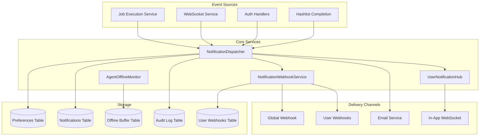
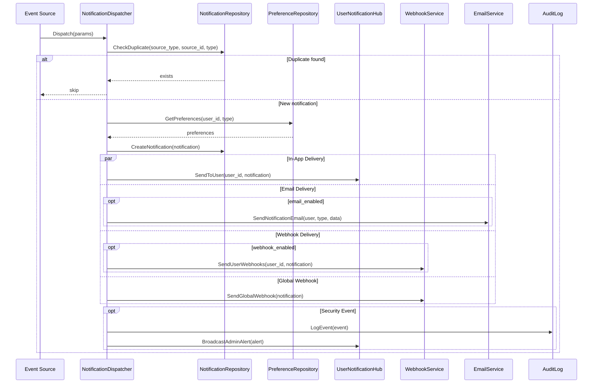
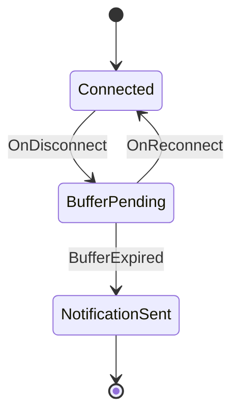

# Notification System Architecture

## Overview

The KrakenHashes notification system provides multi-channel delivery of events to users through in-app notifications, email, and webhooks. This document describes the technical architecture and implementation details.

## System Components



## Notification Types

### Type Definitions

```go
type NotificationType string

const (
    // Job notifications
    NotificationTypeJobStarted           NotificationType = "job_started"
    NotificationTypeJobCompleted         NotificationType = "job_completed"
    NotificationTypeJobFailed            NotificationType = "job_failed"
    NotificationTypeFirstCrack           NotificationType = "first_crack"
    NotificationTypeTaskCompletedWithCracks NotificationType = "task_completed_with_cracks"

    // Agent notifications
    NotificationTypeAgentOffline NotificationType = "agent_offline"
    NotificationTypeAgentError   NotificationType = "agent_error"

    // Security notifications (mandatory)
    NotificationTypeSuspiciousLogin   NotificationType = "security_suspicious_login"
    NotificationTypeMFADisabled       NotificationType = "security_mfa_disabled"
    NotificationTypePasswordChanged   NotificationType = "security_password_changed"

    // System notifications
    NotificationTypeWebhookFailure NotificationType = "webhook_failure"
)
```

### Categories

| Category | Types | Description |
|----------|-------|-------------|
| `job` | job_started, job_completed, job_failed, first_crack, task_completed_with_cracks | Job execution events |
| `agent` | agent_offline, agent_error | Agent status events |
| `security` | security_suspicious_login, security_mfa_disabled, security_password_changed | Security events |
| `system` | webhook_failure | System events |

## NotificationDispatcher

The `NotificationDispatcher` is the central routing service for all notifications.

### Responsibilities

1. **Deduplication**: Prevents duplicate notifications using source tracking
2. **Preference Lookup**: Retrieves user notification preferences
3. **Channel Routing**: Routes notifications to enabled channels
4. **Audit Logging**: Logs security events to audit log
5. **Admin Alerts**: Broadcasts critical events to admin sessions

### Dispatch Flow



### Dispatch Parameters

```go
type DispatchParams struct {
    UserID      uuid.UUID
    Type        NotificationType
    Title       string
    Message     string
    Data        map[string]interface{}
    SourceType  string
    SourceID    string
}
```

### Deduplication

Notifications are deduplicated based on:
- `source_type`: Category of source (job, agent, login, etc.)
- `source_id`: Unique identifier of the source event
- `notification_type`: The type of notification

This prevents duplicate notifications when:
- Server restarts during event processing
- Events are retried after failures
- Multiple handlers trigger for the same event

## UserNotificationHub

Manages WebSocket connections for real-time in-app notifications.

### Architecture

```go
type UserNotificationHub struct {
    mu          sync.RWMutex
    connections map[uuid.UUID]map[*websocket.Conn]bool
}
```

- One hub instance manages all user connections
- Multiple connections per user supported (multiple browser tabs)
- Thread-safe with read-write mutex

### Message Types

| Type | Direction | Description |
|------|-----------|-------------|
| `notification` | Server → Client | New notification payload |
| `unread_count` | Server → Client | Updated unread count |
| `mark_read` | Server → Client | Confirmation of read operation |
| `system_alert` | Server → Client | Real-time admin alert |
| `ping` | Client → Server | Keepalive request |
| `pong` | Server → Client | Keepalive response |

### WebSocket Protocol

1. Client connects to `/user/notifications/ws` with JWT authentication
2. Server registers connection in hub
3. Heartbeat: Client sends ping every 30 seconds
4. Server sends notifications as they occur
5. On disconnect, connection is removed from hub

## NotificationWebhookService

Handles webhook delivery with platform detection and retry logic.

### Platform Detection

```go
func detectPlatform(url string) WebhookPlatform {
    switch {
    case strings.Contains(url, "discord.com/api/webhooks/"):
        return PlatformDiscord
    case strings.Contains(url, "hooks.slack.com/"):
        return PlatformSlack
    case strings.Contains(url, "webhook.office.com/"):
        return PlatformTeams
    default:
        return PlatformGeneric
    }
}
```

### Payload Formats

#### Discord

```json
{
  "embeds": [{
    "title": "Job Completed",
    "description": "Job 'NTLM Attack' completed successfully",
    "color": 3066993,
    "fields": [
      {"name": "Type", "value": "job_completed", "inline": true},
      {"name": "User", "value": "operator1", "inline": true}
    ],
    "timestamp": "2024-01-15T10:30:00Z"
  }]
}
```

#### Slack

```json
{
  "blocks": [
    {
      "type": "header",
      "text": {"type": "plain_text", "text": "Job Completed"}
    },
    {
      "type": "section",
      "text": {"type": "mrkdwn", "text": "Job 'NTLM Attack' completed successfully"}
    },
    {
      "type": "context",
      "elements": [
        {"type": "mrkdwn", "text": "*Type:* job_completed"},
        {"type": "mrkdwn", "text": "*User:* operator1"}
      ]
    }
  ]
}
```

#### Microsoft Teams

```json
{
  "@type": "MessageCard",
  "themeColor": "2eb886",
  "title": "Job Completed",
  "text": "Job 'NTLM Attack' completed successfully",
  "facts": [
    {"name": "Type", "value": "job_completed"},
    {"name": "User", "value": "operator1"}
  ]
}
```

### Retry Logic

```go
type RetryConfig struct {
    MaxRetries     int           // Default: 10
    InitialBackoff time.Duration // Default: 1 second
    MaxBackoff     time.Duration // Default: 5 minutes
    BackoffFactor  float64       // Default: 2.0
}
```

Retry schedule (with defaults):
1. Immediate
2. 1 second
3. 2 seconds
4. 4 seconds
5. 8 seconds
6. 16 seconds
7. 32 seconds
8. 64 seconds
9. 128 seconds
10. 256 seconds (capped at 5 minutes)

### HMAC Signing

When a secret is configured:

```go
func signPayload(payload []byte, secret string) string {
    mac := hmac.New(sha256.New, []byte(secret))
    mac.Write(payload)
    return hex.EncodeToString(mac.Sum(nil))
}
```

Signature is sent in `X-KrakenHashes-Signature` header.

## AgentOfflineMonitor

Monitors agent disconnections and sends notifications after a configurable buffer period.

### State Machine



### Buffer Table

```sql
CREATE TABLE agent_offline_buffer (
    id UUID PRIMARY KEY,
    agent_id UUID NOT NULL REFERENCES agents(id),
    disconnected_at TIMESTAMPTZ NOT NULL,
    notification_due_at TIMESTAMPTZ NOT NULL,
    notification_sent BOOLEAN DEFAULT FALSE,
    notification_sent_at TIMESTAMPTZ,
    reconnected BOOLEAN DEFAULT FALSE,
    reconnected_at TIMESTAMPTZ,
    created_at TIMESTAMPTZ DEFAULT NOW()
);
```

### Monitor Loop

1. Check for pending notifications due every 60 seconds
2. For each due notification:
   - Load agent and owner information
   - Dispatch notification to owner
   - Mark buffer entry as sent
3. Clean up old entries (> 7 days)

## Database Schema

### notifications

```sql
CREATE TABLE notifications (
    id UUID PRIMARY KEY DEFAULT gen_random_uuid(),
    user_id UUID NOT NULL REFERENCES users(id),
    type notification_type NOT NULL,
    title VARCHAR(255) NOT NULL,
    message TEXT NOT NULL,
    data JSONB,
    source_type VARCHAR(50),
    source_id VARCHAR(255),
    is_read BOOLEAN DEFAULT FALSE,
    read_at TIMESTAMPTZ,
    email_sent BOOLEAN DEFAULT FALSE,
    email_sent_at TIMESTAMPTZ,
    email_error TEXT,
    webhook_sent BOOLEAN DEFAULT FALSE,
    webhook_sent_at TIMESTAMPTZ,
    webhook_error TEXT,
    created_at TIMESTAMPTZ DEFAULT NOW(),
    updated_at TIMESTAMPTZ DEFAULT NOW()
);
```

### user_notification_preferences

```sql
CREATE TABLE user_notification_preferences (
    id UUID PRIMARY KEY DEFAULT gen_random_uuid(),
    user_id UUID NOT NULL REFERENCES users(id),
    notification_type notification_type NOT NULL,
    in_app_enabled BOOLEAN DEFAULT TRUE,
    email_enabled BOOLEAN DEFAULT FALSE,
    webhook_enabled BOOLEAN DEFAULT FALSE,
    settings JSONB DEFAULT '{}',
    created_at TIMESTAMPTZ DEFAULT NOW(),
    updated_at TIMESTAMPTZ DEFAULT NOW(),
    UNIQUE(user_id, notification_type)
);
```

### user_webhooks

```sql
CREATE TABLE user_webhooks (
    id UUID PRIMARY KEY DEFAULT gen_random_uuid(),
    user_id UUID NOT NULL REFERENCES users(id),
    name VARCHAR(255) NOT NULL,
    url TEXT NOT NULL,
    secret TEXT,
    notification_types notification_type[] NOT NULL,
    custom_headers JSONB,
    is_active BOOLEAN DEFAULT TRUE,
    retry_count INTEGER DEFAULT 3,
    timeout_seconds INTEGER DEFAULT 30,
    last_triggered_at TIMESTAMPTZ,
    last_success_at TIMESTAMPTZ,
    last_error TEXT,
    total_sent INTEGER DEFAULT 0,
    total_failed INTEGER DEFAULT 0,
    created_at TIMESTAMPTZ DEFAULT NOW(),
    updated_at TIMESTAMPTZ DEFAULT NOW(),
    UNIQUE(user_id, name)
);
```

### audit_log

```sql
CREATE TABLE audit_log (
    id UUID PRIMARY KEY DEFAULT gen_random_uuid(),
    event_type VARCHAR(100) NOT NULL,
    severity VARCHAR(20) NOT NULL,
    title VARCHAR(255) NOT NULL,
    message TEXT NOT NULL,
    user_id UUID,
    username VARCHAR(255),
    email VARCHAR(255),
    ip_address VARCHAR(45),
    user_agent TEXT,
    source_type VARCHAR(50),
    source_id VARCHAR(255),
    data JSONB,
    created_at TIMESTAMPTZ DEFAULT NOW()
);
```

## Performance Considerations

### Indexing Strategy

```sql
-- Notification queries
CREATE INDEX idx_notifications_user_id ON notifications(user_id);
CREATE INDEX idx_notifications_user_unread ON notifications(user_id, is_read) WHERE is_read = FALSE;
CREATE INDEX idx_notifications_created_at ON notifications(created_at DESC);
CREATE INDEX idx_notifications_source ON notifications(source_type, source_id, type);

-- Audit log queries
CREATE INDEX idx_audit_log_created_at ON audit_log(created_at DESC);
CREATE INDEX idx_audit_log_event_type ON audit_log(event_type);
CREATE INDEX idx_audit_log_user_id ON audit_log(user_id);
CREATE INDEX idx_audit_log_severity ON audit_log(severity);
```

### Connection Management

- WebSocket connections use ping/pong heartbeat (54-second interval)
- Connections are cleaned up immediately on disconnect
- Multiple tabs per user are supported efficiently

### Webhook Delivery

- Webhooks are sent asynchronously (non-blocking)
- Retry logic runs in background goroutines
- Timeout prevents hanging connections (default 30s, max 60s)

## Security

### Mandatory Notifications

Security events bypass user preferences:

```go
func isMandatory(t NotificationType) bool {
    switch t {
    case NotificationTypeMFADisabled,
         NotificationTypePasswordChanged:
        return true
    }
    return false
}
```

### Audit Trail

All security events are logged with:
- User identification (ID, username, email)
- Request context (IP address, user agent)
- Event details (severity, message, data)
- Timestamps

### Webhook Secrets

- Secrets are stored encrypted at rest
- Never returned in API responses
- HMAC-SHA256 signing prevents tampering

## Code Locations

| Component | Path |
|-----------|------|
| NotificationDispatcher | `backend/internal/services/notification_dispatcher.go` |
| NotificationWebhookService | `backend/internal/services/notification_webhook_service.go` |
| UserNotificationHub | `backend/internal/services/user_notification_hub.go` |
| AgentOfflineMonitor | `backend/internal/services/agent_offline_monitor.go` |
| Notification Models | `backend/internal/models/notification.go` |
| Audit Log Models | `backend/internal/models/audit_log.go` |
| Notification Repository | `backend/internal/repository/notification_repository.go` |
| Preference Repository | `backend/internal/repository/notification_preference_repository.go` |
| User Webhook Repository | `backend/internal/repository/user_webhook_repository.go` |
| Audit Log Repository | `backend/internal/repository/audit_log_repository.go` |
| User Notification Handlers | `backend/internal/handlers/user/notifications.go` |
| User Webhook Handlers | `backend/internal/handlers/user/webhooks.go` |
| Admin Notification Handlers | `backend/internal/handlers/admin/notification_settings.go` |
| Admin Audit Log Handlers | `backend/internal/handlers/admin/audit_log.go` |
| WebSocket Handler | `backend/internal/handlers/websocket/user_notification_ws.go` |
| Routes | `backend/internal/routes/notification_routes.go` |
| Migrations | `backend/db/migrations/000112-000115_*.sql` |

## Related Documentation

- [Notifications User Guide](../../user-guide/notifications.md)
- [Notification Administration](../../admin-guide/operations/notifications.md)
- [Audit Log](../../admin-guide/operations/audit-log.md)
- [Email Configuration](../../admin-guide/system-setup/email.md)
