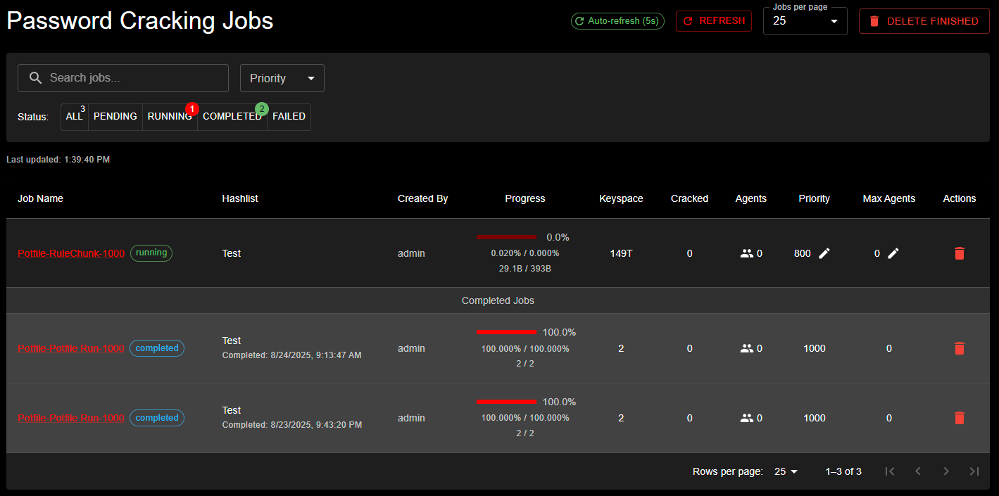

# Understanding Jobs and Workflows

## Quick Overview

KrakenHashes uses a two-tier system to organize password cracking attacks:

1. **Preset Jobs**: Individual attack configurations (like a single recipe)
2. **Job Workflows**: Collections of preset jobs that run in sequence (like a cookbook)

This system ensures consistent, efficient password auditing across your organization.

## How It Works

### The Password Cracking Process

When you submit a hashlist for cracking, KrakenHashes can apply a workflow that:
1. Tries the most likely passwords first (common passwords)
2. Progressively tries more complex attacks
3. Ensures no time is wasted on inefficient approaches

### Example Workflow in Action

Imagine you're auditing passwords for a company. A typical workflow might:

1. **First**: Check against known leaked passwords (fast, high success rate)
2. **Next**: Try common passwords with variations (password1, Password123!)
3. **Then**: Combine company terms with numbers (CompanyName2024)
4. **Finally**: Attempt more exhaustive searches if needed

<screenshot: Visual workflow diagram>

## Benefits

### Consistency
- Every password audit follows the same proven methodology
- No steps are accidentally skipped
- New team members can run expert-level audits immediately

### Efficiency
- Fast attacks run first, finding easy passwords quickly
- Resource-intensive attacks only run when necessary
- Priority system ensures optimal resource usage

### Customization
- Different workflows for different scenarios:
  - Quick compliance checks
  - Thorough security audits  
  - Industry-specific patterns
  - Post-breach assessments

## Common Attack Types

### Dictionary Attacks
Uses lists of known passwords:
- Common passwords (password, 123456)
- Previously leaked passwords
- Industry-specific terms

### Rule-Based Attacks
Applies transformations to dictionary words:
- Capitalize first letter
- Add numbers at the end
- Replace letters with symbols (@ for a, 3 for e)

### Hybrid Attacks
Combines dictionaries with patterns:
- Dictionary word + 4 digits (password2024)
- Year + dictionary word (2024password)

### Brute Force
Tries all possible combinations for a pattern:
- All 4-digit PINs (0000-9999)
- All 6-character lowercase (aaaaaa-zzzzzz)

### Increment Mode Attacks
Systematically tests patterns of increasing (or decreasing) length:
- Starts with shortest pattern, progresses to longest
- Each length is processed as a separate "layer"
- Useful for PIN attacks (2-8 digit), password length exploration
- Works with Brute Force and Hybrid attack modes

**Example**: A mask `?d?d?d?d?d?d` with increment mode (min=4, max=6) tests:

1. `?d?d?d?d` (4 digits: 0000-9999)
2. `?d?d?d?d?d` (5 digits: 00000-99999)
3. `?d?d?d?d?d?d` (6 digits: 000000-999999)

This is more efficient than creating three separate preset jobs!

### Association Attacks (v1.4.0+)

Association attacks (hashcat mode `-a 9`) test password candidates against specific hashes in a 1:1 mapping:
- Hash on line N is tested against candidate password on line N
- Requires an association wordlist with exactly the same line count as your hashlist
- Useful for targeted attacks with user-specific password hints

**Common Use Cases:**
- Testing known passwords from previous breaches against current accounts
- Password reuse detection across systems
- Targeted attacks using personal information (birthdays, pet names, etc.)
- Testing variations of previously cracked passwords

**Requirements:**
- Association wordlist line count must **exactly match** hashlist hash count
- Original hash order is preserved during the attack
- Rules can be combined with association attacks for password variations

**Example**: You have 1,000 user hashes and corresponding password hints:

```
Hashlist (1,000 lines):
$ntlm$abc123...  (user1)
$ntlm$def456...  (user2)

Association Wordlist (1,000 lines):
user1birthday2020
user2petname!
```

Hash 1 is tested against "user1birthday2020", hash 2 against "user2petname!", etc.

!!! tip "Combining with Rules"
    Association attacks support rules. If you use a rule file with 100 rules, each hash-candidate pair will be tested with 100 rule transformations applied to the candidate password.

See [Association Wordlists](hashlists.md#association-wordlists-v140) for how to upload and manage association wordlists.

## Understanding Priorities

Jobs within workflows run in priority order:
- **Critical Priority (90-100)**: Emergency response, security incidents
- **High Priority (70-89)**: Time-sensitive audits, compliance deadlines
- **Normal Priority (40-69)**: Standard security assessments
- **Low Priority (10-39)**: Background processing, research tasks
- **Minimal Priority (0-9)**: Non-urgent, opportunistic processing

### How Priority Affects Your Jobs

Priority determines how many agents your job receives and when it runs:

**1. Agent Allocation Based on Priority:**
- **Higher priority jobs**: Get ALL available agents (max_agents setting is overridden)
- **Same priority jobs**: Respect max_agents limit, share overflow agents based on allocation mode
- **Lower priority jobs**: Wait until higher priority jobs complete or release agents

**2. Execution Order:**
- Jobs start in priority order (highest first)
- Within the same priority, older jobs start first (FIFO)

**3. Resource Control:**
- **max_agents setting**: Controls resource usage for jobs at the **same priority**
- **Overflow allocation mode**: Determines how extra agents are distributed (FIFO or round-robin)
- **Priority override**: Higher priority jobs ignore max_agents and take all resources

**Real-World Example:**

You have 10 agents available and submit two jobs:
```
Job A: Priority 90, max_agents = 5 (urgent client deadline)
Job B: Priority 50, max_agents = 10 (background research)

Result:
- Job A gets ALL 10 agents (higher priority overrides max_agents)
- Job B waits until Job A completes
```

If both jobs have priority 50:
```
Job A: Priority 50, max_agents = 5
Job B: Priority 50, max_agents = 5
10 agents available

FIFO Mode (default):
- Job A: 10 agents (created first, gets overflow)
- Job B: 0 agents (waits for Job A)

Round-Robin Mode:
- Job A: 5 agents
- Job B: 5 agents
```

**Key Takeaway**: Use higher priority for time-critical jobs to get maximum resources immediately. For jobs at the same priority, max_agents controls resource sharing.

<screenshot: Priority visualization>

## Job Interruption and Resumption

KrakenHashes includes an intelligent job interruption system that ensures critical tasks get the resources they need without losing work on other jobs.

### How Job Interruption Works

When a high-priority job needs immediate attention:

1. **Automatic Detection**: The system identifies when critical jobs are waiting
2. **Smart Interruption**: Only interrupts lower priority jobs when necessary
3. **Progress Preservation**: All completed work is saved before interruption
4. **Seamless Resumption**: Interrupted jobs automatically continue when resources are available

### What This Means for Your Jobs

- **No Lost Work**: If your job is interrupted, it will resume from where it stopped
- **Transparent Process**: You'll see the job status change from "running" to "pending" and back
- **Fair Resource Sharing**: The system balances urgent needs with ongoing work
- **Automatic Management**: No manual intervention required for resumption

### Understanding Job Statuses


*The Jobs Management interface showing active password cracking jobs with status filtering (ALL, PENDING, RUNNING, COMPLETED, FAILED). The table displays job details including name, hashlist, progress, keyspace, cracked count, agents assigned, priority level, and available actions.*

- **Pending**: Job is waiting for available agents
- **Running**: Job is actively being processed by agents
- **Processing**: Job execution has finished but system is receiving cracked passwords from agents
- **Completed**: Job finished successfully and all results have been processed
- **Failed**: Job encountered an error
- **Paused**: Job was manually paused or interrupted for a higher priority task

### Priority Best Practices

To ensure optimal performance:

1. **Use Appropriate Priorities**: Don't mark everything as high priority
2. **Plan for Interruptions**: Expect that low-priority jobs may pause for critical work
3. **Monitor Progress**: Check job status regularly for time-sensitive tasks
4. **Communicate Urgency**: Work with administrators to set correct priorities for critical audits

## Automatic Job Completion

KrakenHashes automatically detects when all hashes in a hashlist have been cracked and manages the lifecycle of related jobs to prevent failures and wasted resources.

### How It Works

When an agent reports hashcat status code 6 (all hashes cracked):

1. **Detection**: Backend receives status code 6 from hashcat's JSON status output
2. **Trust Model**: Status code 6 is trusted as authoritative (no database verification needed)
3. **Running Jobs**: Currently executing jobs are stopped and marked as completed at 100%
4. **Pending Jobs**: Jobs that haven't started yet are automatically deleted
5. **Notifications**: Email notifications sent for completed jobs (if configured)

### Why This Matters

Hashcat's `--remove` option removes cracked hashes from the input file during execution. If all hashes are cracked, the file becomes empty, causing subsequent jobs to fail. This automatic detection prevents those failures.

### What You'll See

- Job progress reaches 100% when hashcat finishes processing
- Job status may briefly show "processing" while cracked passwords are being received
- Job status changes to "completed" once all results are processed
- Email notification sent when job truly completes (not during processing)
- Related pending jobs for the same hashlist disappear from the queue

The "processing" status ensures that completion emails contain accurate crack counts and that all discovered passwords are properly stored before the job is marked as complete.

This ensures your workflow doesn't encounter errors when your cracking campaign is successful!

### Technical Details

For administrators and developers interested in the implementation:
- Status code 6 detection occurs in the agent's hashcat output parser
- The `AllHashesCracked` flag is transmitted via WebSocket to the backend
- `HashlistCompletionService` handles the cleanup asynchronously
- See the [Job Completion System](../reference/architecture/job-completion-system.md) architecture documentation for full details

## Monitoring Job Execution

### The Job Details Page

Once you've submitted a job, you can monitor its progress in real-time through the Job Details page. Access it by clicking on any job in the Jobs list or navigating to `/jobs/{job-id}`.

<!-- Job Details Page screenshot placeholder -->
*The Job Details page shows real-time progress, assigned agents, and crack results*

### Real-Time Updates

The Job Details page provides live updates for active jobs:

#### Auto-Refresh
- **Automatic Updates**: The page refreshes every 5 seconds for running jobs (configurable by administrators)
- **Smart Refresh**: Auto-refresh pauses when you're editing settings to prevent data loss
- **Manual Refresh**: Click the refresh button for immediate updates
- **Status-Based**: Auto-refresh only active for pending, running, or paused jobs

#### Progress Visualization

The new progress bar provides at-a-glance job status:
- **Visual Progress**: Color-coded bar showing completion percentage
- **Keyspace Coverage**: Shows processed vs. total keyspace
- **Time Estimates**: Estimated time remaining based on current speed
- **Agent Distribution**: See how work is distributed across agents

### Information Available

#### Job Summary
- **Status**: Current job state (pending, running, completed, failed)
- **Priority**: Job priority level and queue position
- **Hashlist**: Target hashlist being processed
- **Workflow**: Associated workflow and current preset job

#### Performance Metrics
- **Hash Rate**: Combined speed across all agents (H/s, MH/s, GH/s)
- **Keyspace Progress**: Amount of keyspace processed
- **Cracks Found**: Real-time count of cracked passwords
- **Efficiency**: Cracks per billion attempts

#### Agent Assignment
- **Active Agents**: List of agents currently working on the job
- **Agent Performance**: Individual agent hash rates and progress
- **Task Distribution**: How chunks are distributed
- **Agent Status**: Online/offline status of assigned agents

#### Crack Results
- **Real-Time Cracks**: See passwords as they're cracked
- **Crack Positions**: Where in the attack the crack occurred
- **Plain Text**: Recovered passwords (if permissions allow)
- **Export Options**: Download results in various formats

#### Completed Tasks History

The Job Details page maintains a comprehensive history of all completed tasks, providing valuable insights into job execution:

##### Information Displayed
For each completed task, you can view:
- **Agent ID**: The specific agent that processed the task
- **Task ID**: Unique identifier for reference and troubleshooting  
- **Completion Time**: When the task finished processing
- **Keyspace Range**: The exact portion of keyspace that was processed
- **Final Progress**: The percentage of the task that was completed
- **Average Speed**: Hash rate achieved during task execution
- **Cracks Found**: Number of passwords cracked (click to view details in the POT)

##### Organization and Navigation
- **Automatic Sorting**: Tasks are sorted by completion time, with most recent first
- **Pagination Controls**: Navigate through large task lists with configurable page sizes:
  - 25 items per page (default)
  - 50, 100, or 200 items for larger views
- **Persistent History**: Completed tasks remain visible even after job completion

##### Use Cases
The completed tasks history helps with:
- **Performance Analysis**: Compare hash rates across different agents to identify performance variations
- **Crack Distribution**: See which keyspace ranges yielded the most cracks
- **Troubleshooting**: Identify if specific agents or keyspace ranges had issues
- **Audit Trail**: Maintain a complete record of job execution for compliance or review
- **Resource Planning**: Analyze task completion patterns to optimize future job configurations

!!! tip "Performance Insights"
    Use the completed tasks table to identify your most efficient agents and optimize task distribution in future jobs.

### Interactive Controls

While monitoring your job, you can:

#### Adjust Settings
- **Change Priority**: Modify job priority to speed up or slow down execution
- **Agent Limits**: Adjust maximum agents assigned to the job
- **Pause/Resume**: Temporarily halt job execution

#### Job Actions
- **Stop Job**: Terminate the job (progress is saved)
- **Clone Job**: Create a new job with the same settings
- **View Logs**: Access detailed execution logs
- **Export Results**: Download crack results and reports

### Understanding Progress Indicators

#### Keyspace Progress
The keyspace represents the total search space:
- **Linear Progress**: Steady advancement through wordlist attacks
- **Chunk-Based**: Progress jumps as chunks complete
- **Rule Multiplication**: Progress may seem slow with large rule sets
- **Accurate Tracking**: Progress values are captured directly from hashcat for precision

!!! tip "Accurate Progress Tracking"
    KrakenHashes captures actual keyspace values directly from hashcat (`progress[1]`), ensuring that progress percentages accurately reflect the real search progress, especially for jobs with rules or combination attacks where estimation can be inaccurate.

#### Increment Mode Progress

For increment mode jobs, progress represents the aggregate across all layers:

- Each mask length runs as a separate layer
- The Job Details page shows an **Increment Layers** table with per-layer progress
- Overall progress aggregates all layers: (processed across all layers) / (total keyspace)

!!! info "Layer-Based Execution"
    KrakenHashes decomposes increment mode into discrete layers for distributed processing. Multiple agents can work on different layers simultaneously, maximizing efficiency. See [Increment Mode Architecture](../reference/architecture/increment-mode.md) for technical details.

#### Time Estimates
Estimated completion times are based on:
- Current hash rate
- Remaining keyspace
- Historical performance
- Agent availability
- Actual keyspace values from hashcat

!!! note "Estimate Accuracy"
    Time estimates become more accurate as the job progresses and the system learns the actual performance characteristics. After the first benchmark or progress update, the system uses actual keyspace values from hashcat instead of estimates.

### Monitoring Best Practices

1. **Check Early Progress**: Verify the job started correctly in the first few minutes
2. **Monitor Agent Assignment**: Ensure sufficient agents are assigned
3. **Watch for Stalls**: If progress stops, check agent status
4. **Review Partial Results**: Examine cracked passwords as they appear
5. **Adjust Priority if Needed**: Increase priority for time-sensitive jobs

### Troubleshooting Job Issues

#### Job Stuck in Pending
- Check if agents are available
- Verify agent scheduling settings
- Review job priority relative to other jobs

#### Slow Progress
- Check assigned agent count
- Review chunk size settings
- Verify network connectivity
- Consider increasing job priority

#### No Cracks Found
- Normal for strong passwords
- Review attack methodology
- Consider different workflows
- Check hashlist format

## Real-World Applications

### Compliance Auditing
Verify passwords meet policy requirements:
- Minimum length checks
- Complexity requirements
- Banned password lists

### Security Assessments
Identify weak passwords before attackers do:
- Test against current attack techniques
- Benchmark password strength
- Provide actionable reports

### Incident Response
Quickly assess breach impact:
- Check if compromised passwords are reused
- Identify affected accounts
- Prioritize password resets

## What This Means for You

As a user, the preset jobs and workflows system:
- Ensures thorough password testing
- Provides consistent results
- Optimizes cracking time
- Delivers actionable insights

Your administrators have configured these workflows based on:
- Industry best practices
- Your organization's specific needs
- Current threat landscape
- Compliance requirements

## Next Steps

- Review your hashlist results to understand which attacks succeeded
- Work with your security team to address found passwords
- Consider implementing stronger password policies
- Schedule regular password audits using these workflows

For more detailed information about creating and managing workflows, see the [administrator documentation](../admin-guide/advanced/presets.md).