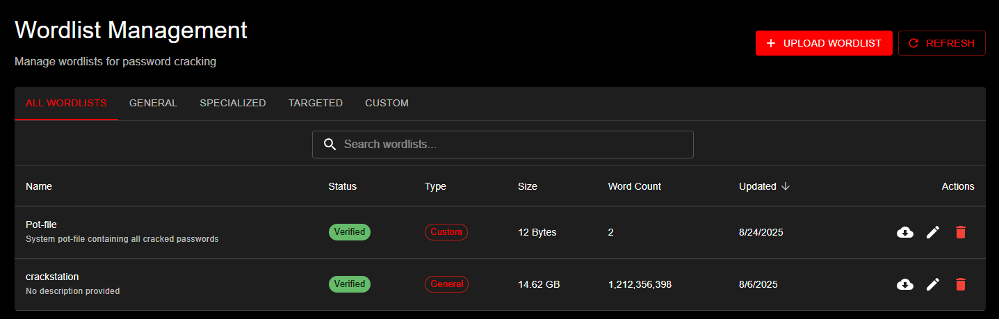
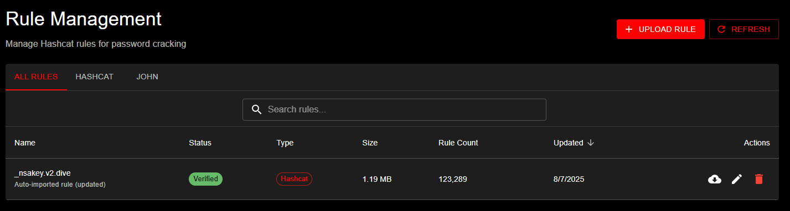

# Wordlists and Rules User Guide

This guide explains how to use the wordlist and rule management features in KrakenHashes.

## Overview

KrakenHashes provides comprehensive management of wordlists and rules used for password cracking operations. These resources are essential for effective password cracking jobs.

## Accessing the Management Interface

1. Log in to the KrakenHashes web interface
2. Navigate to the "Resources" section in the main menu
3. Select either "Wordlists" or "Rules" to manage the respective resources

## Wordlists Management

### Viewing Wordlists

The wordlists page displays all available wordlists with the following information:
- Name
- Description
- Type (General, Specialized, Targeted, Custom)
- Format (Plaintext, Compressed)
- Size
- Word count
- Tags
- Status

*Wordlist Management interface showing category filtering, wordlist details table, and upload functionality*

You can sort and filter the list by any of these attributes.

### Uploading a Wordlist

To upload a new wordlist:

1. Click the "Upload Wordlist" button
2. Fill in the following information:
   - Name (optional - defaults to filename)
   - Description (optional)
   - Type (General, Specialized, Targeted, Custom)
   - Tags (optional)
3. Select the file to upload
4. Click "Upload"

The system will:
- Check if a file with the same name already exists
- Calculate the MD5 hash of the file
- Count the words in the file
- Store the file in the appropriate directory based on the selected type

For large files, the word counting process may take some time. The wordlist will be available with a "pending" status until counting completes.

### Downloading a Wordlist

To download a wordlist:

1. Find the wordlist in the list
2. Click the "Download" button
3. The file will be downloaded to your computer

### Deleting a Wordlist

When deleting a wordlist, the system checks for dependencies and handles them appropriately:

**Simple Deletion** (no dependencies):
1. Find the wordlist in the list
2. Click the "Delete" button
3. Confirm the deletion in the dialog

**Cascade Deletion** (has dependencies):

If the wordlist is used by jobs, preset jobs, or workflows, the deletion dialog will show:
- **Impact Preview**: A summary of all affected items
- **Affected Items List**: Details of jobs, preset jobs, and workflow steps that will be deleted
- **ID Confirmation**: You must type the wordlist ID to confirm cascade deletion

**What Gets Deleted in a Cascade**:
- Non-completed jobs (pending, running, failed) using this wordlist
- Preset jobs that reference this wordlist
- Workflow steps using those preset jobs
- Workflows that become empty after step removal

**What Is Preserved**:
- Completed jobs (historical records)
- The physical file on disk (must be manually removed)

> **Note**: Deleting a wordlist removes it from the database but does not delete the file from the filesystem.

## Rules Management

### Viewing Rules

The rules page displays all available rules with the following information:
- Name
- Description
- Type (Hashcat, John, Custom)
- Size
- Rule count
- Tags
- Status

*Rule Management page showing the uploaded _nsakey.v2.dive rule file with verification status, type (Hashcat), file size (1.19 MB), and rule count (123,289 rules). Filter tabs allow sorting by rule type.*

You can sort and filter the list by any of these attributes.

### Uploading a Rule

To upload a new rule:

1. Click the "Upload Rule" button
2. Fill in the following information:
   - Name (optional - defaults to filename)
   - Description (optional)
   - Type (Hashcat, John, Custom)
   - Tags (optional)
3. Select the file to upload
4. Click "Upload"

The system will:
- Check if a file with the same name already exists
- Calculate the MD5 hash of the file
- Count the rules in the file
- Store the file in the appropriate directory based on the selected type

### Downloading a Rule

To download a rule:

1. Find the rule in the list
2. Click the "Download" button
3. The file will be downloaded to your computer

### Deleting a Rule

When deleting a rule, the system checks for dependencies and handles them appropriately:

**Simple Deletion** (no dependencies):
1. Find the rule in the list
2. Click the "Delete" button
3. Confirm the deletion in the dialog

**Cascade Deletion** (has dependencies):

If the rule is used by jobs, preset jobs, or workflows, the deletion dialog will show:
- **Impact Preview**: A summary of all affected items
- **Affected Items List**: Details of jobs, preset jobs, and workflow steps that will be deleted
- **ID Confirmation**: You must type the rule ID to confirm cascade deletion

**What Gets Deleted in a Cascade**:
- Non-completed jobs (pending, running, failed) using this rule
- Preset jobs that reference this rule
- Workflow steps using those preset jobs
- Workflows that become empty after step removal

**What Is Preserved**:
- Completed jobs (historical records)
- The physical file on disk (must be manually removed)

> **Note**: Deleting a rule removes it from the database but does not delete the file from the filesystem.

## Managing Tags

Tags help organize and categorize wordlists and rules.

### Adding Tags

To add a tag to a wordlist or rule:

1. Find the item in the list
2. Click the "Edit" button
3. Add the tag in the tags field
4. Click "Save"

### Removing Tags

To remove a tag:

1. Find the item in the list
2. Click the "Edit" button
3. Remove the tag from the tags field
4. Click "Save"

## Duplicate Handling

The system handles duplicate files intelligently:

- If you upload a file with the same name as an existing file and the content is identical (same MD5 hash), the system will recognize it as a duplicate and return the existing entry.
- If you upload a file with the same name but different content, the system will update the existing file with the new content.
- If you upload a file with different name but identical content to an existing file, the system will store both files separately.

This approach ensures that:
- Files are not unnecessarily duplicated
- Updates to existing files are properly tracked
- You can maintain multiple versions of similar files with different names

## Best Practices

1. **Use descriptive filenames**: Choose clear, descriptive filenames that indicate the content and purpose of the file.
2. **Add meaningful descriptions**: Include detailed descriptions to help other users understand the purpose and content of the wordlist or rule.
3. **Use appropriate types**: Select the correct type for each wordlist or rule to ensure proper organization.
4. **Apply relevant tags**: Use tags to categorize and make resources easier to find.
5. **Organize by purpose**: Use the specialized and targeted categories for wordlists with specific purposes. 